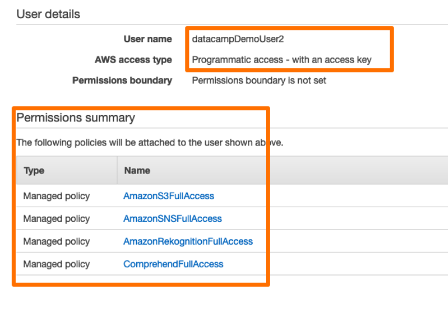
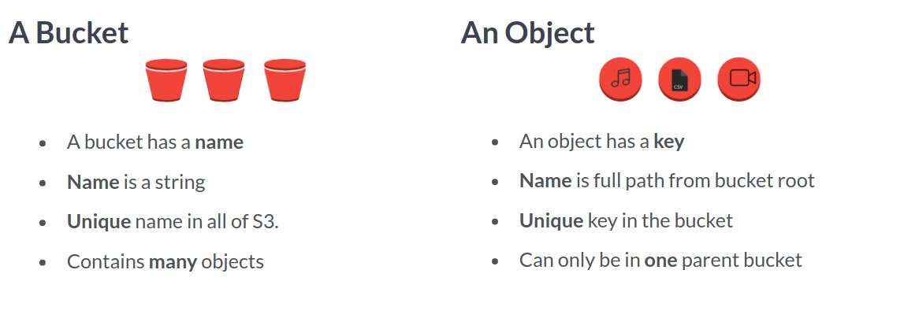

# Introduction to AWS Boto in Python
## Maksim Pecherskiy

# Putting Files in the Cloud!
- Boto3 is a package/server that is owned and developed by AWS.
- You import it using `import boto3`.
- You initalize it using the format:
```python3
s3 = boto3.client(
  's3',
  region_name='us-east-1',
  aws_access_key_id=<AWS_KEY_ID>,
  aws_secret_access_key=<AWS_SECRET>)
```
- The service name can be any of the 100s of AWS services.
- You can then get the buckets using `reponse = s3.list_buckets()`.
- You will create an account at [AWS](AWS.amazon.com).
- We create **IAM Users** to manage access to different services.

- S3 allows us to put images up and make them access to anywhere in the world.
- The main components are **Objects** and **Buckets**.
- *Buckets* are like folders on our desktop.
- *Objects* are like files in those folders.
- They have their own permission policies.
- They can also serve as Website storage for static sites.
- They also generate logs about their own activity.
- Actions we can do with buckets are:
  1. Create them.
  2. List their contents.
  3. Delete them.
- You can create a bucket using:
```python
bucket = s3.create_bucket(Bucket='gid-requests')
```
- Bucket names need to be unique across all of s3.
- You can get the dictionary of buckets using:
```python
buckets = bucket_response['Buckets']
print( buckets )
```
- To delete a bucket you would do:
```python
response = s3.delete_bucket('<bucket-name>')
```
- Iterate over names of buckets:
```python
# Iterate over Buckets from .list_buckets() response
for bucket in response['Buckets']:

  	# Print the Name for each bucket
    print(bucket['Name'])
```

- You can upload a file using:
```python
s3.upload_file(
  Filename='<local-file>',
  Bucket='<bucket-name>',
  Key='<filename-in-bucket>'
)
```
- You can get a list of files using:
```python
response = s3.list_objects(
  Bucket='<bucket-name>',
  MaxKeys=<n>, # limit number of responses; max 1000.
  Prefix='<string-match-prefix>'
)
```
- If you want the metadata for a single object, then you can use:
```python
response = s3.head_objects(
  Bucket='<bucket-name>',
  Key='<filename>'
)
```
- To download files, we use the function:
```python
s3.download_file(
  Filename='<file-name-local>',
  Bucket='<bucket-name>',
  Key='<filename-in-cloud>'
)
```
- You can delete an object using:
```python
s3.delete_object(
  Bucket='<bucket-name>',
  Key='<filename-in-cloud>'
)
```
- Examples:
```python
# Upload final_report.csv with key 2019/final_report_01_01.csv
s3.upload_file(Bucket='gid-staging',
               # Set filename and key
               Filename='final_report.csv',
               Key='2019/final_report_01_01.csv')

# Get object metadata and print it
response = s3.head_object(Bucket='gid-staging',
                       Key='2019/final_report_01_01.csv')
```
```python
# List only objects that start with '2018/final_'
response = s3.list_objects(Bucket='gid-staging',
                           Prefix='2018/final_')

# Iterate over the objects
if 'Contents' in response:
  for obj in response['Contents']:
      # Delete the object
      s3.delete_object(Bucket='gid-staging', Key=obj['Key'])

# Print the remaining objects in the bucket
response = s3.list_objects(Bucket='gid-staging')

for obj in response['Contents']:
  	print(obj['Key'])
```


# Sharing Files Securely
- AWS defaults to deny access.
- There are Four Ways we can control permissions:
  1. IAM
  2. Bucket Policies.
  3. ACLs
  4. Presigned URLs
- ACLs are entities attached to objects.
- To change the ACL, you would use:
```python
s3.put_object_acl(
  Bucket='<bucket-name>',
  Key='<file-name>',
  ACL='public-read'
)
```
- You can also include `ExtraArgs = {'ACL':'public-read'}`.
- Once uploaded, anyone can access it using the url *https://{bucket}.s3.amazon.com/{key}*.
- We can use the function `.download_file()` to download private files.
- You can also use:
```python
obj = s3.get_object(Bucket='gid-requests', Key='<filenam>')
print( obj )
```
- This will give you some metadata about the file as well as a **StreamingBody** object.
- These are a special kind of object that doesn't actually download all of the file but Pandas can deal with just fine.
- You can generate a **Pre-signed URL** for others to use for a short time.
- You can do this with:
```python
share_url = s3.generate_presigned_url(
  ClientMethod = 'get_object',
  ExpiresIn=3600,
  Params={'Bucket', 'git-requests', 'Key':'potholes.csv'}
)
```
```python
for file in response['Contents']:
    # For each file in response load the object from S3
    obj = s3.get_object(Bucket='gid-requests', Key=file['Key'])
    # Load the object's StreamingBody with pandas
    obj_df = pd.read_csv(obj['Body'])
    # Append the resulting DataFrame to list
    df_list.append(obj_df)
```
- S3 can serve HTML pages.
- Pandas has a method called `.to_html()` which will convert dataframes to HTML tables.
- We can use the parameter `render_links=True` to turn links into hyperlinks.
- We can pass the columns that we want as well.
- We have some limited control over the formatting too.
- When sending the file to S3, you will want to add `'ContentType':'text/html'` to the `ExtraArgs` parameter.
- You will want to make sure to get the *ContentType* correct so it renders properly.
```python
# Generate an HTML table with no border and selected columns
services_df.to_html('./services_no_border.html',
           # Keep specific columns only
           columns=['service_name', 'link'],
           # Set border
           border=0)
```
```python
# Convert the response contents to DataFrame
objects_df = pd.DataFrame(objects_list['Contents'])

# Create a column "Link" that contains Public Object URL
base_url = "http://gid-reports.s3.amazonaws.com/"
objects_df['Link'] = base_url + objects_df['Key']
```


# Reporting and Notifying!
- Amazon SNS stands for **Simple Notification Service**.
- In this Architecture, Publishers publish messages to an SNS Topic and Subscribers receive them.
- To create an SNS Topic:
```python
sns = boto3.client(
  'sns',
  region_name='<region>',
  aws_access_key_id=<AWS_ID>,
  aws_secret_access_key=<AWS_SECRET>
)

response = sns.create_topic(Name='<topic-name>')
```
- In return, we will get an API response with the details we need to send results.
- If you try and create a topic with the same name, then it will return the ARN of the already existing topic.
- You can get the list of topics are user has acess to using `sns.list_topics()`
- To delete a topic, you pass a *TopicARN* to `sns.delete_topic()`.
```python
# Get the current list of topics
topics = sns.list_topics()['Topics']

for topic in topics:
  # For each topic, if it is not marked critical, delete it
  if "critical" not in topic['TopicArn']:
    sns.delete_topic(TopicArn=topic['TopicArn'])

# Print the list of remaining critical topics
print(sns.list_topics()['Topics'])
```
- There are three parts to a Subscriber:
  1. ID
  2. Endpoint.
  3. Protocol
- To set this up via code:
```python
response = sns.subscribe(
  TopicArn = '<arn>',
  Protocol = '<protocol>',
  Endpoint = '<endpoint>'
)
```
- In response, we will get a *SubscriptionArn*.
- Don't forget that an email user will need to to confirm.
- To see what users belong to a topic, you can use:
```python
sns.list_subscriptions_by_topic(
  TopicArn = '<topic-arn>'
)
```
- To delete a subscription, we do:
```python
sns.unsubscribe(
  SubscriptionArn='<subscription-arn>'
)
```
```python
# List subscriptions for streets_critical topic, convert to DataFrame
response = sns.list_subscriptions_by_topic(
  TopicArn = str_critical_arn)
subs = pd.DataFrame(response['Subscriptions'])
```
```python
# For each subscription, if the protocol is SMS, unsubscribe
for sub in response['Subscriptions']:
  if sub['Protocol'] == 'sms':
	  sns.unsubscribe(SubscriptionArn=sub['SubscriptionArn'])

# List subscriptions for streets_critical topic in one line
subs = sns.list_subscriptions_by_topic(
  TopicArn=str_critical_arn)['Subscriptions']
```
- By publishing a message to a Topic, all our subscribers will receive it.
- To do this:
```python
repsonse = sns.publish(
  TopicArn = '<topic-arn>',
  Message = '<body>',
  Subject = 'Subject for email'
)
```
- To send a single SMS message use:
```python
response = sns.publish(
  PhoneNumber = '<phone-number>',
  Message = '<text>'
)
```
- One of the important roles of a Data Engineer is balancing getting stuff done and maintaining it.
```python
for index, user_row in contacts.iterrows():
  # Get topic names for the users's dept
  critical_tname = '{}_critical'.format(user_row['Department'])
  extreme_tname = '{}_extreme'.format(user_row['Department'])

  # Get or create the TopicArns for a user's department.
  critical_arn = sns.create_topic(Name=critical_tname)['TopicArn']
  extreme_arn = sns.create_topic(Name=extreme_tname)['TopicArn']
```


# Pattern Rekognition

# Research:

# Reference:
