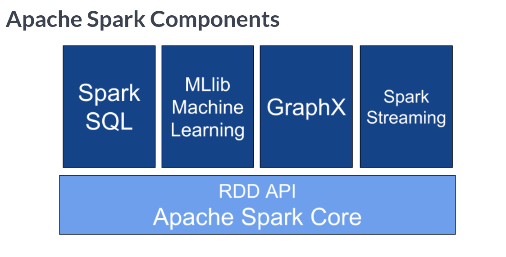
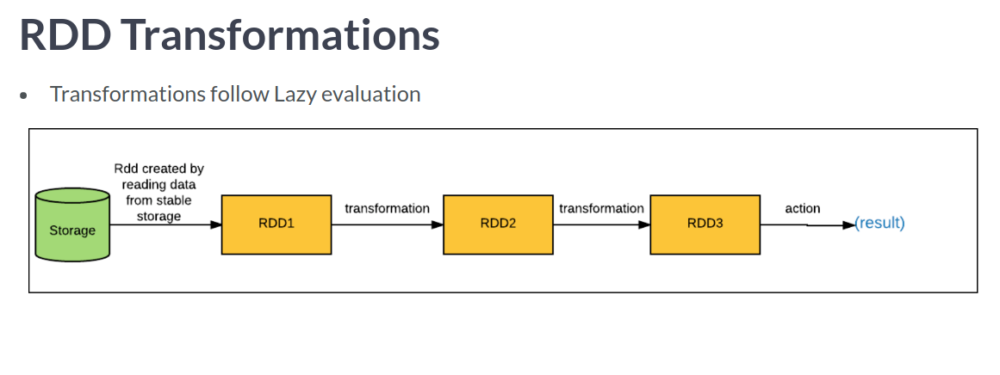
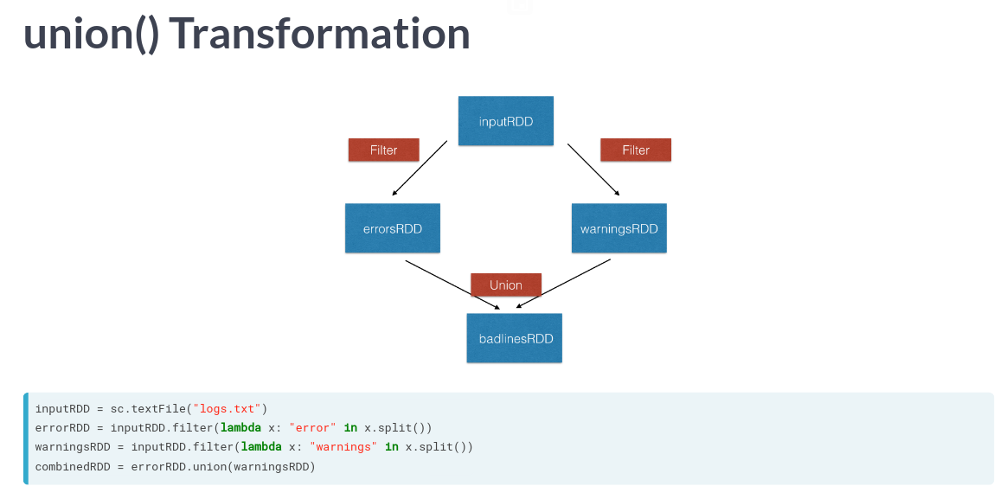
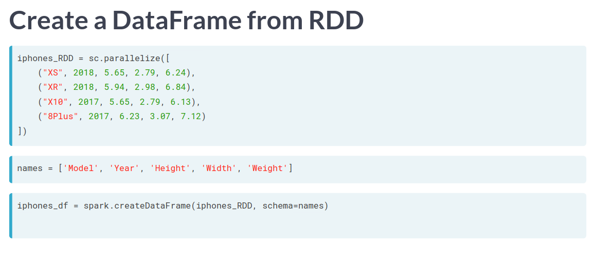
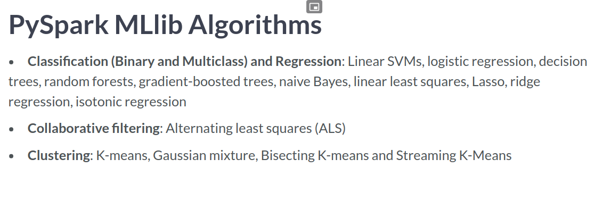
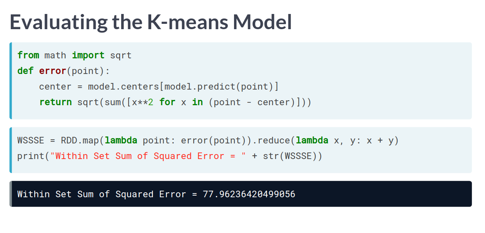

# Big Data Fundamentals with PySpark
## Upendra Kumar Devisetty

# Introduction to Big Data Analysis with Spark
- According to Wikipedia, **Big Data** is defined as the study and applications of ddata sets what are too complex for traditional data-processing software.
- The three V's of Big Data are:
  1. Volume.
  2. Variety
  3. Velocity.
- Terminology:
  * **Clustered Computing** is the collection of resources of multiple machines.
  * **Parallel Computing** is the simultaneous computation of data.
  * **Distributed Computating** is the involvement of multiple nodes or computers in a job collection.
  * **Batch Processing** is the breaking of jobs into smaller pieces and running on individual machines.
  * **Real-time Processing** is the immediate processing of data as it arrives.
- While Spark is not the only project for this, we'll be learning it.

- There are two modes for running Spark:
  1. Local Mode.
  2. Cluster Mode.
- Apache Spark is written in Scala.
- Spark comes with Interactive Shells which assist in analysis.
- Python's version is called *PySpark* - which we'll be using.
- To interact with Spark, you will need the entry point called the **Spark Context**.
- When you're inside the *spark context*, you will have access to it using the variable `sc`.
- You can get version information using `sc.version` and `sc.pythonVer`.
- You can find who the master is using `sc.master`.
- You can load data into Spark using `parallelize()`:
```python
rdd = sc.parallelize([1,2,3,4,5,6])
```
- ... or you could load a text file using `textFile()`
```python
rdd2 = sc.textFile("test.txt")
```
- **Anonymous Functions** - or **Lambda Function** - are functions which are not bound to a name at runtime.
- It is very common to see them used with the `filter()` and `map()` functions.
- The syntax is shown here:
```python
lambda arguments: expression
```
- The lambda function has no return statement and always contains an expression.
- The `map()` function takes a function and a list and returns a new list with the function applied to each item.
- The syntax for `map()` is:
```python
map(function, list)
```
- The `filter()` function takes a function and a list and returns values which are evaluated to true.


# Programming in PySpark RDD’s
- The fundamental unit of data in Spark is the **Resliient Distributed Dataset(RDD)**.
- The name captures three important properties:
  1. *Resilient*: Ability to withstand failures.
  2. *Distributed*: Spanning across multiple nodes.
  3. *Dataset*: Collection of Partitioned data.
- There are three methods - and the last one to know is creating them from existing RDDs.
- Understanding partitioning in PySpark helps control parallelism.
- A **Partition** is a logical division of a large dataset distributed to multiple locations.
- You can control this by setting the minimum number of partitions using `minPartitions` passed to the creation functions.
- You can find out how many partitions exist uing the function `.getNumPartitions()`.
- Spark Operations are broken into **Transformations** and **Actions**.
- *Transformations* create new RDDs and *Actions* perform computations on the RDDs.
- Transformations follow **Lazy Evaluation** which is when the transformations are graphed but not executed:

- You can join multiple RDDs together using the `.union()` function:

- **Actions** are what return values and execute on the graph.
- The actions we're going to learn about are `collect()`, `take()`, `first()` and `count()`.
  * `collect()` returns all the elements.
  * `take()` returns `<n>` values from the RDD.
  * `first()` returns a single element from the RDD.
  * `count()` returns the number of elements.
- Plenty of real world data sets are key,value pairs.
- To manage this data, PySpark uses a special data structure called a **Paired RDD**.
- With these, the *key* is the identifier and the *value* is the data.
- The two most common ways to create these is from a key,value tuplue or a regular RDD.
- Here is an example using tuples:
```python
my_tuple = [('Sam', 23), ("Mary", 34), ("Peter", 25)]
pairRDD_tuple = sc.parallelize(my_tuple)
```
- ... or from a regular RDD:
```python
my_list = ['Sam 23', "Mary 34", "Peter 25"]
regularRDD = sc.parallelize(my_list)
pairRDD_RDD = regularRDD.map(lambda s: (s.split(' ')[0], s.split(' ')[1]))
```
- Make sure when calling functions, that they expect key,value pairs.
- The most common is `.reduceByKey()` which combines values with the same key.
- Note that this is not an action but is a transformation.
- The next common is `.sortByKey()` which orders pair RDD's by Key.
- Note that the keys must be sortable.
- Another is `.groupByKey()` which is useful to group all values with the same key.
- The `.join()` function will join two RDD values together by the shared keys.

```python
# Create PairRDD Rdd with key value pairs
Rdd = sc.parallelize([(1,2), (3,4), (3,6), (4,5)])

# Apply reduceByKey() operation on Rdd
Rdd_Reduced = Rdd.reduceByKey(lambda x, y: x + y)

# Iterate over the result and print the output
for num in Rdd_Reduced.collect():
  print("Key {} has {} Counts".format(num[0], num[1]))
```
```python
# Sort the reduced RDD with the key by descending order
Rdd_Reduced_Sort = Rdd_Reduced.sortByKey(ascending=False)

# Iterate over the result and print the output
for num in Rdd_Reduced_Sort.collect():
  print("Key {} has {} Counts".format(num[0], num[1]))
```
- The `.reduce()` action is used to aggregate the elements of a RDD.
- This function should be commutative and associative.
- The `.saveAsTextFile()` action saves a RDD into a text file inside a directory with each partition as a separate file.
- However, you can force it into a single file using the `.coalesce()` function.
- Now we'll check out `.countByKey()` which is only available for RDDs with a key,value relationship.
- It will count the number of keys per dataset.
- You should not call this function unless the data is small enough to fit in memory.
- The function `.collectAsMap()` return the key-value pairs in the RDD as a dictionary.
```python
# Transform the rdd with countByKey()
total = Rdd.countByKey()

# What is the type of total?
print("The type of total is", type(total))

# Iterate over the total and print the output
for k, v in total.items():
  print("key", k, "has", v, "counts")
```
```python
# Create a baseRDD from the file path
baseRDD = sc.textFile(file_path)

# Split the lines of baseRDD into words
splitRDD = baseRDD.flatMap(lambda x: x.split())

# Count the total number of words
print("Total number of words in splitRDD:", splitRDD.count())
```
```python
# Convert the words in lower case and remove stop words from stop_words
splitRDD_no_stop = splitRDD.filter(lambda x: x.lower() not in stop_words)

# Create a tuple of the word and 1
splitRDD_no_stop_words = splitRDD_no_stop.map(lambda w: (w, 1))

# Count of the number of occurences of each word
resultRDD = splitRDD_no_stop_words.reduceByKey(lambda x, y: x + y)
```
```python
# Display the first 10 words and their frequencies
for word in resultRDD.take(10):
	print(word)

# Swap the keys and values
resultRDD_swap = resultRDD.map(lambda x: (x[1], x[0]))

# Sort the keys in descending order
resultRDD_swap_sort = resultRDD_swap.sortByKey(ascending=False)

# Show the top 10 most frequent words and their frequencies
for word in resultRDD_swap_sort.take(10):
	print("{} has {} counts". format(word[1], word[0]))
```


# PySpark SQL & DataFrames
- PySpark SQL is a Spark library for structured data.
- PySpark DataFrame is an immutable distributed collection of data with named Columns.
- They support SQL queries or expressions.
- Spark Session provides a single point of entry to Spark DataFrames.
- This is exposed as `spark` in a Pyspark shell.
- There are two main ways to create these:
  1. From an existing RDD.
  2. From data sources using a `.read()` method.

- To create a DataFrame from a CSV file use:
```python
df_csv = spark.read.csv("people.csv",   header=True, inferSchema=True)
df_csv = spark.read.json("people.json", header=True, inferSchema=True)
df_csv = spark.read.txt("people.txt",   header=True, inferSchema=True)
```
- DataFrames of course also support Transformations and Actions.
- `.show()` is an action and will get values.
- Operations that are also support:
  * `.groupBy()`
  * `.filter()`
  * `.orderBy()`
  * `.dropDuplicates()`
- You can rename a column and return a new dataFrame using `.withColumnRenamed()`:
```python
test_df_sex = test_df.withColumnRenamed('Gender', 'Sex')
test_df_sex.show(3)
```
- You can print the schema of the data frame using `.printSchema()`.
- You can print just the column names using `.columns`
- You can calculate and print the summary statistics using `.describe()`.
- In PySpark you can interact with SparkSQL through the dataFrame API and SQL Queries.
- The API provides a programmatic domain-specific language for data.
- The spark session has a method for this called `.sql()`.
- You will need to create a temporary table for this to work:
```python
df.createOrReplaceTempView('table1')
df2 = spark.sql("SELECT field1, field2 FROM table1")
df2.collect()
```
- Data visualization is fundamental to solving problems.
- While there are plenty of tools to visualize data, none of the common ones can be used directly with Spark.
- There are at least three though:
  1. pyspark_dist_explore library
  2. `.toPandas()`
  3. HandySpark
- We'll start with pyspark_dist_explore first.
- It supports the functions `.hist()`, `.distplot()` and `pandas_histogram()`.
- For a histogram, you would select the column you wanted and then call the function:
```python
test_df_age = test_df.select('Age')
hist(test_df_age, bins=20, color = 'red')
```
- It it really easy to create charts in pandas Data Frames.
- See the other courses.
- The package *Handy Spark* is designed to improve the PySpark User Experience.
- Once the data is loaded, you would create a Handy Data Frame.
```python
hdf = test_df.toHandy()
hdf.cols['Age'].hist()
```


# Machine Learning with PySpark MLlib
- Now we're going to work with getting Machine Learning in Spark working.
-  To do this, Spark comes with **MLlib** which implements some common Machine Learning algorithms at scale.
- While scikit for python is useful, they only work for small to medium data sets.
- It also provides a high-level API for making pipelines.
- There are different categories of Machine Learning:

- We will focus on three of them:
  1. Collaboration.
  2. Classification.
  3. Clustering.
- You import **Collaborative Filtering**  via `pyspark.mllib.recommendation import ALS`.
- You import **Logistic Regression** via ` pyspark.mllib.classification import LogisticRegressionWithLBFGS`
- You import **KMeans using** via `pyspark.mllib.clustering import KMeans`
- **Collaborative Filtering** is finding users that share common interests.
- This has two kinds:
  * *User-User* which finds users that a similar to the target user.
  * *Item-item* finds and recommends items that are similar to items with the target user.
- The Rating Class is a wrapper around a tuple.
- It is useful for creating an RDD with user,product ratings.
```python
from pyspark.mllib.recommendation import Rating
r = Rating(user = 1, product = 2, rating = 5.0)
```
- Don't forget to split the data into a training,testing subsets for evaluating predictive modeling.
- Pyspark comes with a function called `.randomSplit()` which can do this for us.
```python
data = sc.parallelize(range(1,11))
training,test = data.randomSplit([.6,.4])
training.collect()
test.collect()
```
- **Alternating Least Squares** checks previous user purchases and compares them to what they might purchase.
```python
# build
r1 = Rating(1,1,1.0)
r2 = Rating(1,2,2.0)
r3 = Rating(2,1,2.0)

# collect
ratings = sc.parallelize([r1,r2,r3])
ratings.collect()

# train
model = ALS.train(ratings, rank=10, iterations=10)
```
- Then, you apply the model using `.predictAll()`
```python
predictions = model.predictAll(unrated_RDD)
predictions.collect()
```
- For model evaluation, we will measure it with the **Mean Square Error** which is the average value of the square of `(<actual-rating> - <predicted-rating)`.
```python
# Prepare ratings data
rates = ratings_final.map(lambda r: ((r[0], r[1]), r[2]))

# Prepare predictions data
preds = predictions.map(lambda r: ((r[0], r[1]), r[2]))

# Join the ratings data with predictions data
rates_and_preds = rates.join(preds)

# Calculate and print MSE
MSE = rates_and_preds.map(lambda r: (r[1][0] - r[1][1])**2).mean()
print("Mean Squared Error of the model for the test data = {:.2f}".format(MSE))
```
- **Classification** is a supervised machine learning algorithm for sorting the input data into different categories.
- Classification can be either Binary - between two categories - or Multi-class.
- The most common method to solve this is **Logistic Regression** which predicts a binary response based on some variables.
- To use this, we will need to understand *Vectors* and *LabelledPoints*.
- There are two kinds of Vectors:
  1. Dense: which store all the entries.
  2. Sparse: store only the non-zero values.
- You create it using `Vectors.dense()` or `Vectors.sparse()`.
- A **LabelledPoint** is a wrapper for input features and a predicted Value.
- For binary classification, a label is either 0 or 1.
```python
# Create a HashingTf instance with 200 features
tf = HashingTF(numFeatures=200)

# Map each word to one feature
spam_features = tf.transform(spam_words)
non_spam_features = tf.transform(non_spam_words)

# Label the features: 1 for spam, 0 for non-spam
spam_samples = spam_features.map(lambda features:LabeledPoint(1, features))
non_spam_samples = non_spam_features.map(lambda features:LabeledPoint(0, features))

# Combine the two datasets
samples = spam_samples.join(non_spam_samples)

# Split the data into training and testing
train_samples,test_samples = samples.randomSplit([0.8, 0.2])

# Train the model
model = LogisticRegressionWithLBFGS.train(train_samples)

# Create a prediction label from the test data
predictions = model.predict(test_samples.map(lambda x: x.features))

# Combine original labels with the predicted labels
labels_and_preds = test_samples.map(lambda x: x.label).zip(predictions)

# Check the accuracy of the model on the test data
accuracy = labels_and_preds.filter(lambda x: x[0] == x[1]).count() / float(test_samples.count())
print("Model accuracy : {:.2f}".format(accuracy))
```
- There is also a way to product a Term Frequency Document using the function `HashingTF()`.
- Example:
```python
from pyspark.mllin.feature import HashingTF

sentence = "hello hello hello"
words = sentence.split()
tf = HashingTF(10000) # vectors of size 10000
tf.transform(words)
```
- **Clustering** is the unsupervised learning task to organize a collection of data into Groups.
- For this, PySpark comes with some options:
  1. K-Means
  2. Gaussian Mixture
  3. Power Iteration Clustering( PIC )
  4. BiSection K-means
  5. Streaming K-Means
- We'll be focusing on Kmeans.
- A constraint is that the data is a set of numerical features.
- Example:
```python
from pyspark.mllib.clustering import KMeans
model = KMeans.train(RDD, k = 2, maxIterations = 10)
model.clusterCenters
```

```python
# Train the model with clusters from 13 to 16 and compute WSSSE
for clst in range(13, 17):
    model = KMeans.train(rdd_split_int, clst, seed=1)
    WSSSE = rdd_split_int.map(lambda point: error(point)).reduce(lambda x, y: x + y)
    print("The cluster {} has Within Set Sum of Squared Error {}".format(clst, WSSSE))

# Train the model again with the best k
model = KMeans.train(rdd_split_int, k=15, seed=1)

# Get cluster centers
cluster_centers = model.clusterCenters
```


# Research:
- pyspark.ml ?
- HashingTF?


# Reference:
