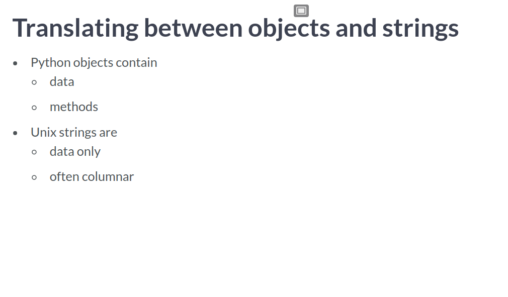
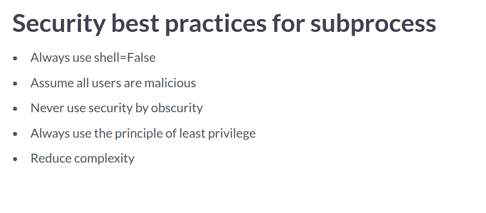
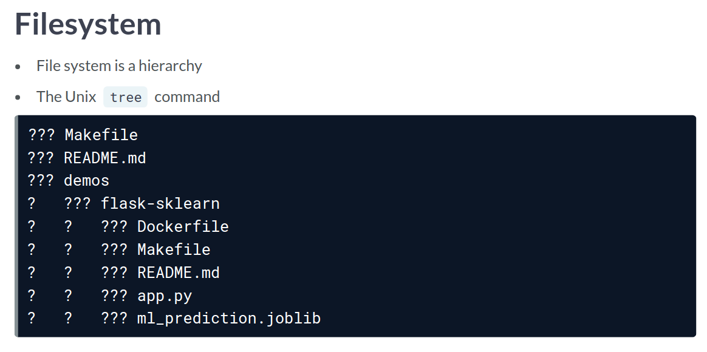
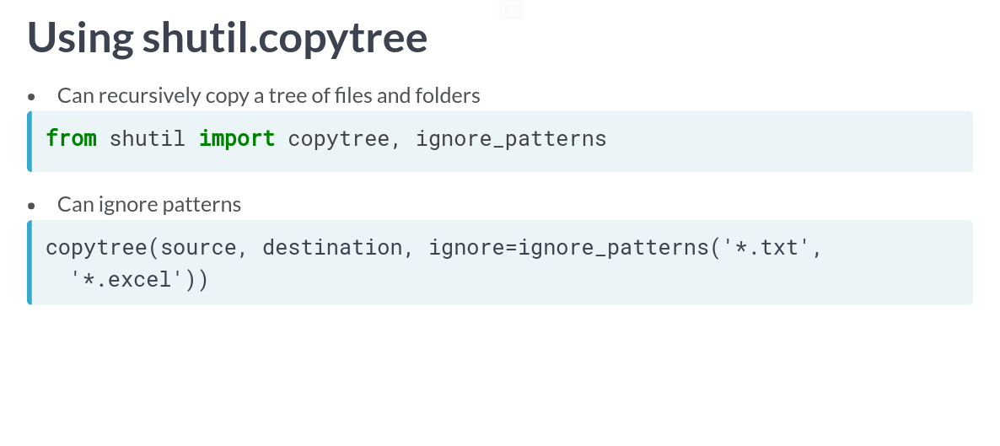

# Command Line Automation in Python
## Noah Gift

# IPython shell commands
- "Most of my experience has been automating myself out of a job and as a result gaining a better one."
- The Three Laws of Automation:
  1. Any task talked about being automated will be.
  2. If it isn't automated, then it is broken.
  3. If a human is doing it, then a machine will eventually do it better.
- IPython allows shell commands to be run using `!`
- Using the columnar structure, we can parse it into a Slist datatype.
- When you collect the output, it is in a datatype called **Slist**.
- This datatype is actually quite powerful and comes with ways to extract from fields.
- You can call the file itself or you can test small snippets of code using:
```bash
python -c "import datetime;print(datetime.datetime.utcnow())"
```
- One of the most important principles of Unix is that the operating system should contain simple applications which can be connected together to create complex systems.
- One way to collect the output is with the bash magic command `%%bash --output` which will run a block of bash code and collect the output.
- Standard out and standard error both must be captured while doing this.
- You can collect the errors using:
```jupyter
%%bash --out output --err error
ls -l | awk '{ SUM+=$5} END {print SUM}'
echo "no error so far" >&2
```
- There are three main methods for an *SList* object:
  1. fields.
  2. grep
  3. sort
- The `fields()` method will accept a "wildcard" column selection:
```python
ls.fields(1,5)[1:4]
```
- The `grep()` method is basically grep like inside linux.
- The `sort()` method accepts two possible arguments:
  1. which column to sort on?
  2. whether to sort of alphanumeric values.
- It is also easy to treat them like regular lists and do things like `.pop()`.


# Shell commands with subprocess
- The simplest way to run shell commands in python 3.5+ is `subprocess.run()` class.
```python
subprocess.run(['ls', '-l'])
```
- Handling strings in python 3 is more powerful but more complex.
- In python 3, you will need to decide strings from bytes:
```python
res = b'reply      24   0.0 0.0 923874 pts/0   R+ 03:15    0:00 ps aux\n'
regular_string = res.decode("utf-8")
```
- If a command exits with a 0 status then it succeeded.
- If a command exits with a non-zero status then it failed.
- You can print the last exit status using `$?`.
- You can check this also via the *Completed Process Object*.
- The process return code can be collected using `<obj>.returncode`
- You can collect the output from a shell commmand using `subproces.PIPE`:
```python
# Execute Unix command `head` safely as items in a list
with subprocess.Popen(["head", "poem.txt"], stdout=subprocess.PIPE) as head:

  # Print each line of list returned by `stdout.readlines()`
  for line in head.stdout.readlines():
    print(line)
```
- `Popen` also supports contexts:
```python
with Popen(['ls'], stdout=PIPE) as proc:
  out = proc.readlines()
```
- Reminder that the **with statement** can handle closing processes and simplifies code.
- You can also set a limit on the amount of time it is allowed to try and run:
```python
try:
  out, error = proc.communicate(timeout=30)
  # ...
except TimeoutExpired:
  proc.kill()
```
- `PIPE` acts just like the unix pipe.
- The attribute `stdout` is where you collect the output from.
- It has two functions:
  1. `.read()` returns string.
  2. `.readlines()` returns an iterator.
- It is not best practice to use `shell=True`; this can allow arbitrary code to be executed.
- `stderr` can be use to capture errors.
- You can also leverage Python's json package to convert out of string data:
```python
# Use the with context manager to run subprocess.Popen()
with Popen(["pip","list","--format=json"], stdout=PIPE) as proc:
  # Pipe the output of subprocess.Popen() to stdout
  result = proc.stdout.readlines()

# Convert the JSON payload to a Python dictionary
# JSON is a datastructure similar to a Python dictionary
converted_result = json.loads(result[0])
```
- Example of managing failed processes:
```python
# Start a long running process using subprocess.Popen()
proc = Popen(["sleep", "6"], stdout=PIPE, stderr=PIPE)

# Use subprocess.communicate() to create a timeout
try:
    output, error = proc.communicate(timeout=5)

except TimeoutExpired:

	# Cleanup the process if it takes longer than the timeout
    proc.kill()

    # Read standard out and standard error streams and print
    output, error = proc.communicate()
    print(f"Process timed out with output: {output}, error: {error}")
```
- There are two ways to accept input from another process:
  1. via `stdin` with `Popen()`
  2. via `input` with `run()`
- The primary language in Unix is strings.

- It is common to consider security after a problem is solved; this doesn't make it go away.
- You can use the shlex module to assist with securing user input.
- This will sanitize the input before submitting it.

- Lists also have a function called `extend()`:
```python
# Sanitize the user input
sanitized_user_input = shlex.split(user_input)
print(f"raw_user_input: {user_input} |  sanitized_user_input: {sanitized_user_input}")

# Safely Extend the command with sanitized input
cmd = ["du", "-sh", "--total"]
cmd.extend(sanitized_user_input)
print(f"cmd: {cmd}")
```


# Walking the file system
- In big data, there are two kinds of users who create data on a file system:
  1. Machine.
  2. Human.
- The underlying assumption is that it is a heirarcy.
- You can see this using the `tree` command in Unix.

- You can walk a filesystem in python using `os.walk()`.
- **Lazy Evaluation** can be handy because it only runs when you ask it to.
- It is a common pattern to split a file into the name, extension.
- This pattern is done with ` _, ext = os.path.splittext(fullpath)`.
```python
# Walk the filesystem starting at the test_dir
for root, _, files in os.walk('cattle'):
    for name in files:

        # Create the full path to the file by using os.path.join()
        fullpath = os.path.join(root, name)
        print(f"Processing file: {fullpath}")

        # Rename file
        if "shorthorn" in name:
            p = pathlib.Path(fullpath)
            shortname = name.split("_")[0] # You need to split the name by underscore
            new_name = f"{shortname}_longhorn"
            print(f"Renaming file {name} to {new_name}")
            p.rename(new_name)
```
- There are a few advantages to `Path.glob()`:
  1. finds patterns in directories.
  2. yeilds matches.
  3. can recursively search.
- The pattern is simple:
```python
from pathlib import Path
path = Path('data')
list(path.glob('*.csv'))
```
- To search recursively, you would simply add wildcards in front: `path.glob("**/*.csv")`.
- Another filewalking utilities is `fnmatch()`.
- You can translate a glob into a regex using this function:
```python
import fnmath, re
regex = fnmath.translate('*.csv')
pattern = re.complite(regex)
print(pattern)
```
- An example of using `fnmatch`:
```python
import fnmatch

# List of file names to process
files = ["data1.csv", "script.py", "image.png", "data2.csv", "all.py"]

# Function that returns
def csv_matches(list_of_files):
    """Return matches for csv files"""

    matches = fnmatch.filter(list_of_files, "*.csv")
    return matches

# Call function to find matches
matches = csv_matches(files)
print(f"Found matches: {matches}")
```
- The packages `shutil` and `tempfile` can solve  problems that come up in automation.

- You can also delete a full tree:
```python
from shutil import rmtree
rmtree(source, destination)
```
- A new feature is the ability to archive a tree of data using `shutil.make_archive()`:
```python
from shutil import make_archive
make_archive("some_archive", 'gztar', 'inside_tmp_dir')
```
- Remember that the less code you write, the less bugs there can be.
- Here is an example of using a temporary file:
```python
# Create a self-destructing temporary file
with tempfile.NamedTemporaryFile() as exploding_file:
  	# This file will be deleted automatically after the with statement block
    print(f"Temp file created: {exploding_file.name}")
    exploding_file.write(b"This message will self-destruct in 5....4...\n")

    # Get to the top of the file
    exploding_file.seek(0)

    #Print the message
    print(exploding_file.read())

# Check to sure file self-destructed
if not os.path.exists(exploding_file.name):
    print(f"self-destruction verified: {exploding_file.name}")
```
- The key advantage of `pathlib` is to use object oriented path objects.


# Command line functions

# Research:

# Reference:
