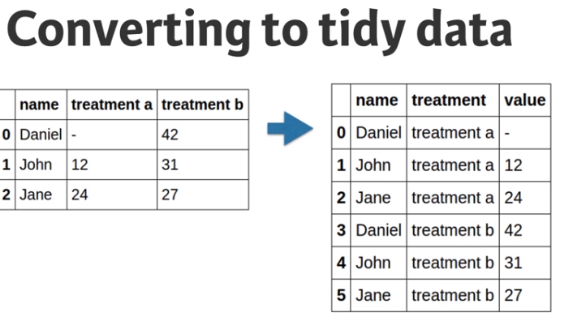
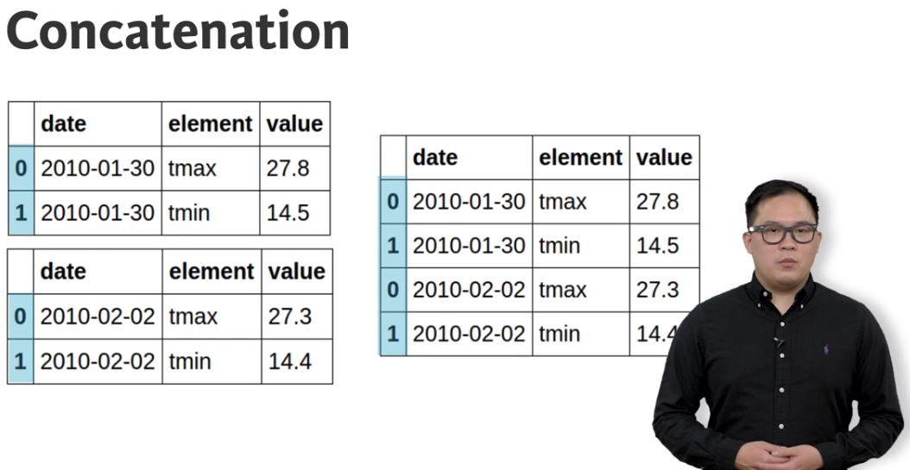
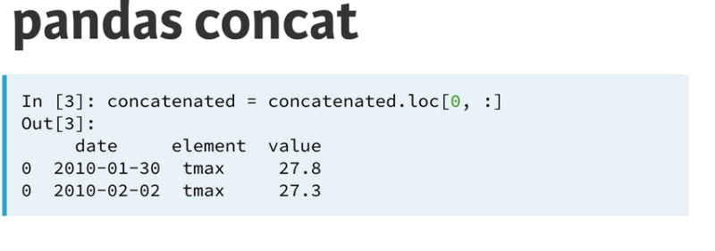
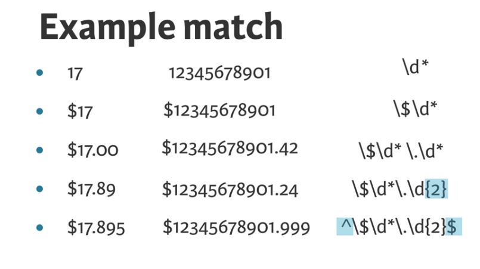

# Cleaning Data in Python
## Daniel Chen

# Exploring Your Data
- **Cleaning Data** is the process of preparing your data for analysis.
- There are some common data problems:
  - Inconsistent Column Names.
  - Missing Data.
  - Outliers.
  - Duplicate Rows.
  - Untidy.
  - Column Types Signal unexpected data values.
- Always import the Pandas library via normal nomenclature.
```python3
import pandas as pd
```
- You read in the data using the function `pd.read_csv()`.
- You can visually inspect the first and last 10 entries using `df.head()` and `df.tail()`.
- You can see the columns using `df.columns`.
- You can see the dimensions using `df.shape`.
- You can get generic information about the object using `df.info()`.
- You can get the frequency of items in a column using: `df.<column>.value_counts(dropna=False)`.
- This will also work with bracket notation.
- Another thing to check is Summary Statistics about the values in numeric Columns.
- Bar plots are for discrete data; Histograms for continuous data.
- You can plot the data using `df.<column>.plot('hist')`.
- You will need to have matplotlib imported using `import matplotlib.pyplot as plt`.
- You can filter as well:
```python3
df[df.population > 1000000000 ]
```
- Boxplots can visualize basic summary statistics for us to use.
- This is created using `df.boxplot(column ='population', by='continent')`.
- Always remember to call `plt.show()` to draw the plot.
- Scatterplots are relationships between 2 numeric variables.


# Tidying Data for Anaylsis
- Data comes in lots of formats but we want it in the **Tidy Data** format.
- Hadley Wickham wrote a paper that defines this called *Tidy Data*.
- There are three principles of this format:
  1. Columns represent separate variables.
  2. Rows represent different observations.
  3. Observational units form tables.
- We'll want to reformat the data:

- The point is there are data formats that are better for reporting vs Analysis.
- We can solve the problem of columns containing values with `pd.melt()`.
- We specify which columns we want to hold constant with `id_vars = []`
```python
# Melt airquality: airquality_melt
airquality_melt = pd.melt(airquality, id_vars=['Month', 'Day'])
```
- We can change what the resulting columns will be called with `var_name` and `value_name` respectively.
```python
# Melt airquality: airquality_melt
airquality_melt = pd.melt(airquality, id_vars=['Month', 'Day'], var_name='measurement', value_name='reading')
```
- The opposite process to **Melting** is called **Pivoting**.
- We'll take the unique values and turn them into separate columns.
- One reason to do this would be to convert from an Analysis Shape to a Report friendly shape.
- To do the pivot, we use the function `df.pivot()`.
- We tell it which column to fix using `index = '<column>'`.
- We tell it which column to pivot into using `columns = '<col-name>'`.
- We tell it what column to use for values using `values = '<col-name>'`.
- If there is a duplicate value is the column we selected, it will fail.
- To manage this, we'll use a different method called `df.pivot_table()`.
- The passed variables are the same but we will use a function to aggregate called `aggfunc = <func>`.
- After the pivot, we got what is called a **Heirarchical Index** or **Multiindex** dataframe.
- We can fix this by re-indexing with the function `df.reset_index()`.
```python
# Create the 'type' column
ebola_melt['type'] = ebola_melt.str_split.str.get(0)
```


# Combining Data for Analysis
- Data doesn't usually come in a single large file.
- Many times it is easier to split up the files for some reason - such as daily.
- You can concatenate using the function `pd.concat(<list-of-dfs>)`.
- When we concatenate data, it keeps its original indexes

- If you select on index after concatenating, you will get multiple rows back.

- You can tell it to ignore the indexes and reindex after concatenating using `ignore_index=True`.
- If you want to add them via column vs row, use the argument `axis = 1`.
```python
# Concatenate ebola_melt and status_country column-wise: ebola_tidy
ebola_tidy = pd.concat( [ebola_melt, status_country], axis = 1)
```
- We can use the python glob library to filter files and collect them for reading.
- **Globbing** is a simple way for python to pattern match files.
- You get glob using `import glob`.
- Pandas has the same ability to join tables as SQL.
- To join to dataframes, you use `pd.merge()`.
- You can tell it which data to join per side using `left = <askdfjaslk>` and `right= <asdjfldsafjkl>`.
- If the names are the same then you can use the `on= <sdlfakj>` argument.
- If they're not, then you will need to specify both column names: `left_on= '<jlsdjfk>'` and `right_on='<sdalfjask>'`.
- There are three kinds of merges:
  1. One-to-One.
  2. Many-to-One.
  3. Many-to-Many


# Cleaning Data for Analysis
- The object datatype is a general catch all usually encoded as a string.
- There are times when we want to convert from one type to another.
- We can convert to another type using `df['<column>].astype(<type>)`.
-  You can convert to factors or categories using `.astype('category')`.
- There are two advantages to converting to categorical.
  1. Can make DataFrames smaller in memory.
  2. Can be utilized by other libraries while doing anaylsis.
- When deal with numbers, you can force errors into numbers using `errors = 'coerce'` inside `pd.to_numeric(df['<column>'])`.
```python
df['treatment a'] = pd.to_numeric(df['treatment a'], errors = 'coerce')
```
- Most of the world's data is contained in unstructured string data.
- Python has many built in libraries for string manipulation.
- The *re* library is for regular expressions.

- In python, you'll want to compile the expression and then match values after.
```python
import re
pattern = re.compile('\$\d*\.\d{2}')
result = pattern.match('$17.89')
```
```python
# Compile the pattern: prog
prog = re.compile('\d{3}-\d{3}-\d{4}')

# See if the pattern matches
result = prog.match('123-456-7890')
print(bool(result))

# See if the pattern matches
result2 = prog.match('1123-456-7890')
print(bool(result2))
```
- We can use the function `df.apply()` to use a function on an axis: row or columns.
- Writing a function is outside the scope of the class.
- When you apply a function over a row, you only get the row itself and not the dataframe.
```python
# Write the lambda function using replace
tips['total_dollar_replace'] = tips.total_dollar.apply(lambda x: x.replace('$', ''))

# Write the lambda function using regular expressions
tips['total_dollar_re'] = tips.total_dollar.apply(lambda x: re.findall('\d+\.\d+', x)[0])
```
- You can drop duplicates using the function `df.drop_duplicates()`.
- For managing missing values, one can:
  1. Leave them.
  2. Drop them.
  3. Fill them.
- You can drop them using `df.dropna()`.
- You can fill the values in with `df.fillna()`.
  - We can fill them user provided values.
  - We can fill with a statistical value.
- We can you use assert statements to check our data after changes.
- If it ends up being true, then it passes with no return result.
- If it ends with being false, then it will throw an error.

# Case Study
- Time to use everything we've played with.
```python
# Write the regular expression: pattern
pattern = '^[A-Za-z\.\s]*$'

# Create the Boolean vector: mask
mask = countries.str.contains(pattern)

# Invert the mask: mask_inverse
mask_inverse = ~mask
```


# Research:

# Reference:
