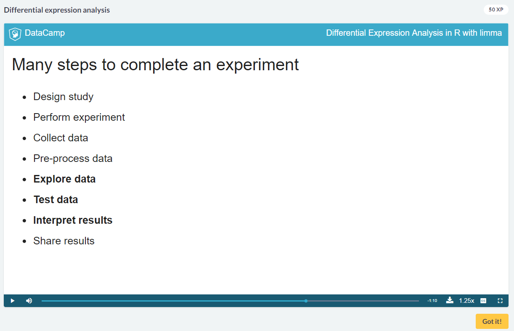
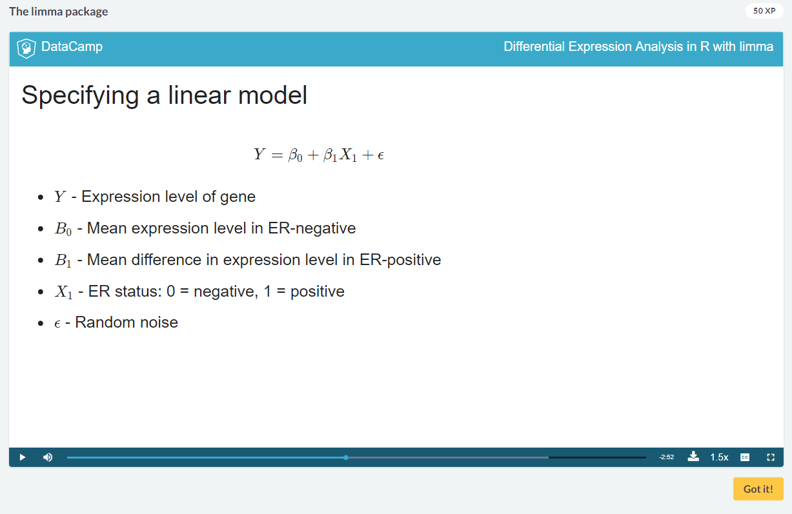
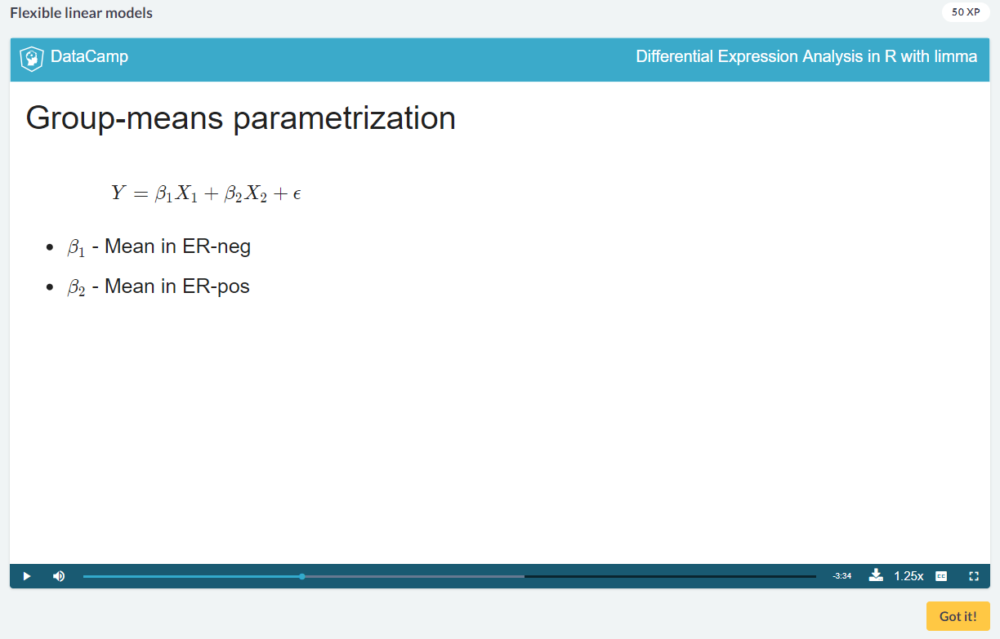

# Differential Expression Analysis in R with limma
## John Blischak

# Differential Expression Analysis
- **Differential Expressions** are statistical comparisons of different measured groups - generally genetics or cells.
- A higher expression level is called **Upregulated**.
- A lower expression level is called **Downregulated**.
- `The overall goal is to identify genes that are associated with a phenotype of interest.`.
- Why *Differential Expression*?:
  1. Novelty: Are there additional genes of interest.
  2. Context: Is the given measurement for the gene unique or common?
  3. Systems: Which biological pathways are important?
- Steps of an experiment:

- **Caveats**:
  * Measurements are relative, not absolute.
  * Statistical methods cannot rescue from a poorly design study.
```
# Create a boxplot of the first gene in the expression matrix
boxplot(x[1,] ~ p[, 'Disease'], main = f[1,'symbol'])
```
- To limit typos, we will be using *Objects* from the **Bioconductor** packages to manage data.
- A **Class** defines a structure to hold complex data.
- An **Object** is a specific instance of a class.
- A **Method** are functions that work on a specific class.
- To install *Bioconductor*, please do this:
```
source("https://bioconductor.org/biocLite.R")
biocLite("Biobase")
```
- We will use the package `Biobase` after it is installed.
```
# Create ExpressionSet object
eset <- ExpressionSet(assayData = x,
                      phenoData = AnnotatedDataFrame(p),
                      featureData = AnnotatedDataFrame(f))
```
- This object can include other pertinent information such as who did the experiment, but we wont be using it.
- You can get access to the different parts of the object using the functions:
  1. `exprs()` for the *Expression Matrix*.
  2. `fData()` for the *Feature Data*.
  3. `pData()` for the *Phenotype data*.
- Now we're going to learn about the package `limma`.
- Advantages of `limma`:
  * Testing thousands of genes would require a lot of boilerplate code.
  * Functions run on the data is ran on all the genes in the dataset.
  * It uses Empirical Bayes.
  * It has lots of functions for pre and post processing.
- Install it using:
```
source("https://bioconductor.org/biocLite.R")
biocLite("limma")
```
- Here is what the *linear Model* looks like:

- You use the function `model.matrix( ~<forumula>, data = <data-frame>)`.
- Running a `colSum` on the model to compare the number of positive samples is a good sanity check.
- You fit a model using the function `lmFit(<data>, <model>)`.
- You can calculate the t-statistic using the function `eBayes( <model> )`.
```
# Summarize results
results <- decideTests(fit[, "er"])
summary(results)
```
- **R automatically chooses the base condition by alphabetical order**.
```
# Create design matrix for leukemia study
design <- model.matrix(~Disease, data = pData(eset))

# Count the number of samples modeled by each coefficient
colSums(design)
```
- **Note that this coefficient name was created by concatenating the column name and the value of the variable that is modeled by that coefficient**.
```
# Load package
library(limma)

# Fit the model
fit <- lmFit(eset, design)

# Calculate the t-statistics
fit <- eBayes(fit)

# Summarize results
results <- decideTests(fit[, "Diseasestable"])
summary(results)
```


# Flexible Models for Common Study Designs
- The linear regression model will become clumsy with many more groups.
- **Treatment Contrast Paramatization**.
- This meanbs that each coefficient models the group mean.

- Since there is no Intercept term in this equation, you cannot do a difference anymore.
- Instead, you will need to do a comparison.
- Now as the number of groups increases, one can simply construct as many contrasts as necessary.
- To create a model without and intercept term, you prepend a `0` to the formula passed.
```
design <- model.matrix(~0 + er, data = pData(eset))
```
- The numbers in each column will be the total of each type of sample.
- We will use the function `limma:makeContrasts( <formula>, levels = <design>)`
```
# Fit the contrasts
fit2 <- contrasts.fit(fit, contrasts = cm)
```
- Remember you just need to pass the column names for each contrast you care about:
```
# Create a contrasts matrix
cm <- makeContrasts(ox05vox01 = oxygenox05 - oxygenox01,
                    ox21vox01 = oxygenox21 - oxygenox01,
                    ox21vox05 = oxygenox21 - oxygenox05,
                    levels = design)
```
- Now we're going to discuss Factorial Experimental Design.
- Since there is no single *Total* attribute, then one will need to be created.
```
# Create design matrix with no intercept
design <- model.matrix(~0 + group)
colnames(design) <- levels(group)
```
- Notice that there is an interaction contrast:
```
cm <- makeContrasts(type_normal = vte2.normal - col.normal,
                    type_low = vte2.low - col.low,
                    temp_vte2 = vte2.low - vte2.normal,
                    temp_col = col.low - col.normal,
                    interaction = (vte2.low - vte2.normal) -
                                  (col.low - col.normal),
                    levels = design)
```


# Pre- and post-processing
- Now we're going to move on to how to manage unclean data.
- Steps that will apply to most data will be:
  1. Log transform.
  2. Quantile Normalize.
  3. Filter.
- To investigate first, you will want to use `limma:plotDensities( <data>, legend = False)`.
- When data has many 0's, then it the density plot will be very *Right Skewed.*.
- You can use the function `limma:normailzeBetweenArrays( exprs( <data> ))` to normalize by quantiles.
- If there is *still* a right skew, then you can take a sum of the rows and then only keep values above a certain point:
```
# Create logical vector
keep <- rowMeans(exprs(eset)) > 5
# Filter the genes
eset <- eset[keep, ]
plotDensities(eset, legend = FALSE)

# -------------------
# Determine the genes with mean expression level greater than 5
keep <- rowMeans(exprs(eset)) > 5
sum(keep)

# Filter the genes
eset <- eset[keep,]
plotDensities(eset, legend = FALSE)
```
- The next biggest concern is **Technical Batch Effects**.
- This is not unique to genomic data, but since there are so many features it is possible to detect them.
- You need to balance variables of interest across batches.
- To diagnose *Technical Batch Effects*, you can use dimensional reduction techniques:
  * Principle Component Analysis.
  * Multidimensional Scaling.
- It starts with the largest source of variation in the Data set.
- You can plot this using the function `limma::plotMDS(<data>, <labels>)`:
```
library(limma)
plotMDS(eset, labels = pData(eset)[, "time"], gene.selection = "common")
```
- When you detect this *batch effect*, it can be undone using the function `removeBatchEffect()`
```
exprs(eset) <- removeBatchEffect(eset, batch = pData(eset)[, "batch"],
                                 covariates = pData(eset)[, "rin"])
```
- This fits a linear model and returns the residuals.
- When constructing your analysis, it is better to create a column for the batches and check how strong the affect is.
- Once you have a model,
-


# Case Study: Effect of Doxorubicin Treatment

# Research:

# Reference:
