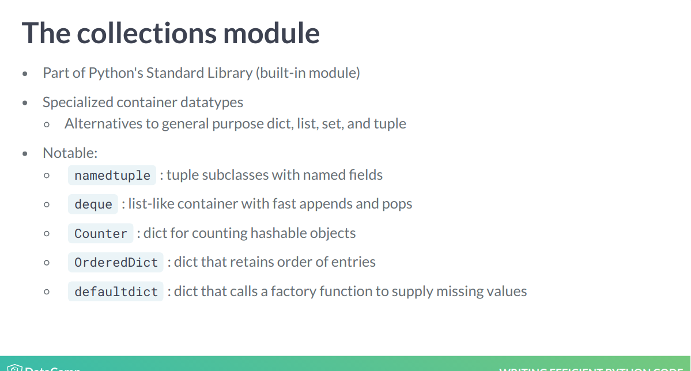
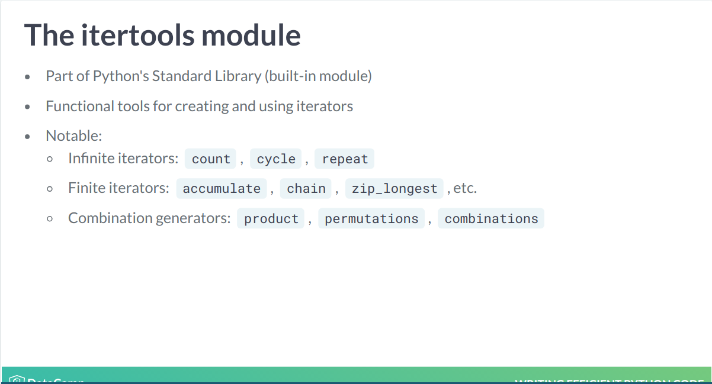
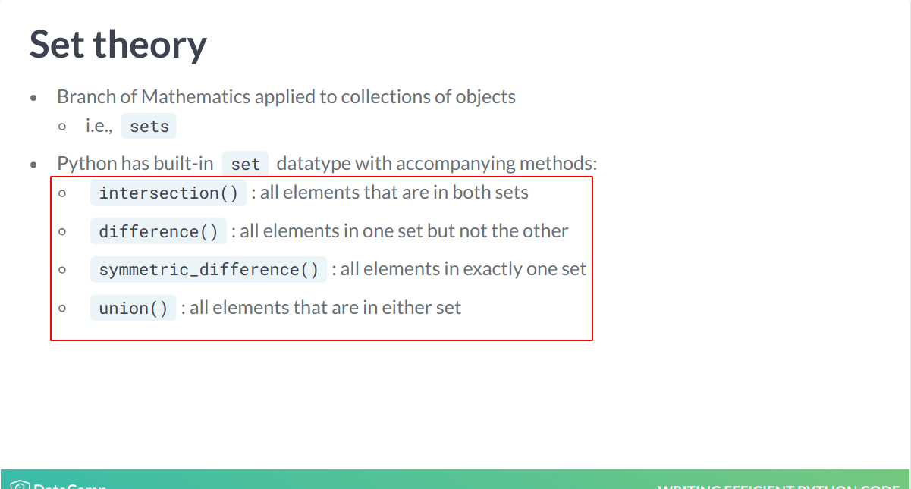

# Writing Efficient Python Code
## Logan Thomas

# Foundations for Efficiencies
- Most of your time should be spent on making meaningful insights.
- We're going to learn:
  * how to write clean, fast and efficient code.
  * How to Profile your code for bottlenecks.
  * How to eliminate bottlenecks and bad design.
- **Efficient** means that code has a fast runtime and allocates minimal resources.
- Python comes with a focus on Readability.
- Code that follows Python best practices is called **Pythonic** code.
```python
# Print the list created by using list comprehension
best_list = [name for name in names if len(name) >= 6]
print(best_list)
```
- Python's built-ins have been optimized to work quickly within python.
- The function `range()` is exclusive; meaning a parameter `11` will give the list `[0, ..., 10]`.
- To create a list of indexed items from a list, use the function `enumerate( <list> )`.
- You can also tell it to skip values and start later using the parameter `start=<n>`.
- You can use a function on all values in a list using the function `map()`.
- **Lambda Functions** are also called **Anonymous Functions**.
```python
# Create a new list of odd numbers from 1 to 11 by unpacking a range object
nums_list2 = [*range(1,12,2)]
print(nums_list2)
```
```python
# Unpack an enumerate object with a starting index of one
indexed_names_unpack = [*enumerate(names, 1)]
print(indexed_names_unpack)
```
- NumPy arrays are memory efficient versions of Python's lists.
- You can check the type of a numPy array using `<arrrayName>.dtypes`.
- Python lists do not support broadcasts while numPy does.
- NumPy Arrays also support boolean indexing.


# Timing and Profiling Code
- We care about the runtime because that allows us to select the optimal coding performance.
- To compare runtimes, we need to be able to compute the runtime.
- **IPython** comes with some handy magic commands that allow us to do this.
- Magic commands are enhancements on top of normal Python syntax.
- These commands re prefixed with the `%` symbol.
- You can see a list of all of them using `%lsmagic`.
- To time the code, you can simply append `%timeit` in front of the code.
```python
%timeit rand_nums = np.random.rand(1000)
```
- You can also pass parameters to control how many runs and loops there are.
```python
# two runs and 10 loops
%timeit -r2 -n10 rand_nums = np.random.rand(1000)
```
- You can tell it to run the whole block as opposed to just the line using `%%` instead.
- You can also tell it to save the results to a variable using the `-o` parameter passed to `%timeit`.
- Then, you can analyze the results:
```python
times.timings # for all runs.
times.best    # for the best run.
times.worst   # for the worst run.
```
- You can create data structures using **Formal Names** which are actually calling the type's function.
- Or, you can use **Literal Syntax** which allows you to select the structure without calling the function.
  - This is jsut syntactic sugar that calls the *formal name* underneath.
- Using the literal syntax is actually faster than formal declaration.
- The advantage of a **Code Profiler** is that it gives us access to the individual duration of function calls.
- We'll be using the package *line_profiler* for this class.
- You will need to install it separately using `python -m pip install line_profiler`.
- To use it, we'll need to load it into our session using `%load_ext line profiler`.
- Now we can use the function call `%lprun` to collect that information.
- The syntax for this means:
  * `-f` for function.
  * Then the name of the function to profile.
  * Finally, the exact function call.
```python
%lprun -f convert_units convert_units(heroes, hts, wts)
```
- Now we'll move on to how to measure the memory footprint.
- There is a quick and dirty function `sys.getsizeof( <object> )`.
- We will be using the package *memory_profiler* to do this.
- You'll need to import it like before.
- `%mprun` can only be run on functions with physical files.
- Once it's in a file, you can import it and then run it:
```python
%load_ext memory_profiler
%mprun -f convert_units convert_units(heroes, hts, wts)
```


# Gaining Efficiencies
- We could enumerate over the list to collect all the data together.
- But, Python has the function `zip()` which can do this for us.
- The function returns a class that needs to be unpacked to collect the actual values.
- The *collections* module has lots of general purpose alternatives to the default data structures.
- Here are some examples:

- Normally, to count the number of distinct objects has some logically overhead.
- With the `collections.Counter()` function, it can take care of that overhead for us.
```python
from collections import Counter

type_counts = Counter( poke_types )
```
- *Counter* returns a dictionary of type based key,value pairs with the value being the actual counts.
- Another module called *itertools* is useful for creating and using iterators.
- Here are some examples:

- Say that we wanted to create a combinatorial list of all values from a list.
- We could do this ourselves but *itertools* already has a function to efficiently do this.
```python
from itertools import combinations
combos = combinations( poke_types, 2)
```
- You will need to unpack the values into a list once generated.
- If you combine lists with multiple lengths, then it will only return up to the length of the shortest list.
```python
# Combine five items from names and three items from primary_types
differing_lengths = [*zip(names[:5], primary_types[:3])]
```
- Often, we'd like to compare objects for their similarities and differences.
- When doing this, it is best to use **Set Theory** from Mathematics.
- Python comes with a built-in *set* datatype.
- Here are some examples:

- Sets also have very fast membership testing.
```python
set_a.intersection( set_b )
set_a.difference( set_b )

# is in one of them but not both:
set_a.symmetic_difference( set_b )
```
- A **Set** is defined as a collection of distinct elements.
- Loops are not necessarily poor practice but they can slow down code.
- There are some benefits to eliminating loops:
  * Fewer lines of code.
  * Better code readability.
- You can sum columns in numpy much faster than in a for loop:
```python
# Create a total stats array
total_stats_np = names.sum(axis=1)
```
- Sometimes you cannot remove the loops though.
- The best way to refactor loops is to analyze what's done per loop iteration.
- Anything that is done once should be moved outside of the loop.
```python
# Import Counter
from collections import Counter

# Collect the count of each generation
gen_counts = Counter( generations )

# Improve for loop by moving one calculation above the loop
total_count = sum( gen_counts.values())

for gen,count in gen_counts.items():
    gen_percent = round( count / total_count, 2)
    print('generation {}: count = {:3} percentage = {}'
          .format(gen, count, gen_percent))
```


# Basic Pandas Optimizations
- Pandas comes with a few methods to efficiently iterate over a dataframe.
- The first one we're going to look at is the function `.iterrows()` which returns each row as a tuple of index,  Panda Series pairs.
- Another function that we'll be using will be `.itertuples()` which does the same thing but for tuples.
- It returns what is called a **Named Tuple** back.
- This is a special datatype from the *collections* module.
- This allows us to access elements using dot notation: `print( row_named_tuple.Index )`.
- They do not support bracket indexing though.
```python
run_diffs = []

# Loop over the DataFrame and calculate each row's run differential
for row in yankees_df.itertuples():

    runs_scored = row.RS
    runs_allowed = row.RA

    run_diff = calc_run_diff(runs_scored, runs_allowed)

    run_diffs.append(run_diff)

# Append new column
yankees_df['RD'] = run_diffs
print(yankees_df)
```
- An alternative to running a for loop is to use Panda's `.apply()` function.
- It acts like the `map()` we've used before but for data frames.
```python
# Convert numeric playoffs to text
textual_playoffs = rays_df.apply(lambda row: text_playoffs(row['Playoffs']), axis=1)
print(textual_playoffs)
```
- Since Pandas are built on top of NumPy, we can use the habits we learned about those.
- Remember that *Broadcasting* is very efficient.


# Research:

# Reference:
