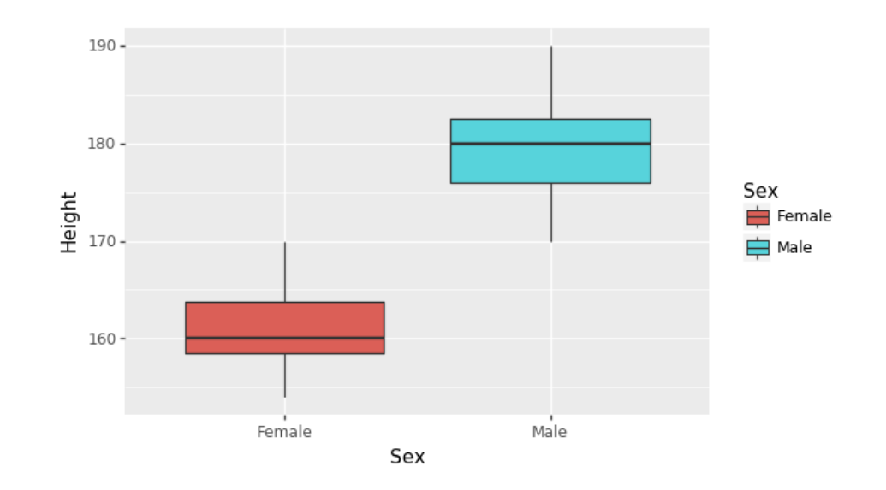
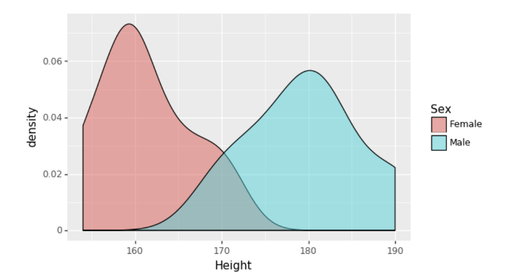

# Experimental Design in Python
## Luke Hayden

# The Basics of Statistical Hypothesis Testing
- This course is going to teach us the basics of how to answer scientific questions.
- In this course, we'll be using the `plotnine` library.
- This uses the Grammar of Graphics approach to displaying and building graphs.
```python
import plotnine as p9

(
  p9.ggplot([<pandas-dataframe>]) +
  p9.aes(
    x = 'Variable to put on X-axis',
    y = 'Variable to put on Y-axis',
    color = 'variable'
  ) +
  p9.geom_point()
)
```
- **Scatter Plot** places each point on the axis's two dimensions; make it with `geom_point()`

- **Box Plot** compares categorical value vs a numeric value; make it with `geom_boxplot()`.

- The **Density Plot** shows where the the data is concentrated; make with `geom_denstiy()`

- Most datasets contain variation and therefore we need to be careful about our conclusions.
- To draw conclusions, we will need to draw conclusions from two hypothesis.
- When the p-value falls below the crucial value - usually .05 - then we reject the null hypothesis.
- We will be using **Student's T-test** for this.
- There are two types:
  1. One-Sample: Mean of a population different from a given value?
  2. Two-Sample: Test if there is a difference in two sample's means.
- We'll use the function `stats.ttest_ind()` for this.
```python
# Create the density plot
print(p9.ggplot(euasdata)+ p9.aes('Sex_ratio', fill="Continent")+ p9.geom_density(alpha=0.5))

# Create two arrays
Europe_Sex_ratio = euasdata[euasdata.Continent == "Europe"].Sex_ratio
Asia_Sex_ratio = euasdata[euasdata.Continent == 'Asia'].Sex_ratio

# Perform the two-sample t-test
t_result= stats.ttest_ind(Europe_Sex_ratio, Asia_Sex_ratio)
print(t_result)

# Test significance
alpha= 0.05
if (t_result[1] < alpha):
    print("Europe and Asia have different mean sex ratios")
else: print("No significant difference found")
```
- The **Chi-Square Test** distinguishes between observed outcomes and a fit distribution.
```python
# Extract sex ratio
sexratio = athletes['Sex'].value_counts()

# Perform Chi-square test
chi= stats.chisquare(sexratio)
print(chi)

# Test significance
alpha= 0.05
if chi[1] < alpha:
    print("Difference between sexes is statistically significant")
else:
    print("No significant difference between sexes found")
```
- The **Fisher Exact Test** tests distinguishes between two different samples.
- To implement this, we first need to create a cross tabulation.
```python
# Create a table of cross-tabulations
table = pd.crosstab(athletes.MedalTF, athletes.Sport)
print(table)

# Perform the Fisher exact test
fisher = stats.fisher_exact(table, alternative='two-sided')
print(fisher)

# Is the result significant?
alpha = 0.05
if fisher[1] < alpha:
    print("Proportions of medal winners differ significantly")
else:
    print("No significant difference in proportions of medal winners found")
```
- The **Pearson's Correlation R** compares two continuous samples for a relationship.
```
# Run the correlation test
pearson = stats.pearsonr(athletes.Weight, athletes.Year)
print(pearson)

# Test if p-value is bigger or smaller than alpha
alpha = 0.05
if pearson[1] < alpha:
    print("Weights and year are significantly correlated")
else:
    print("No significant correlation found")
```


# Design Considerations in Experimental Design

# Sample size, Power analysis, and Effect size

# Testing Normality: Parametric and Non-parametric Tests

# Research:

# Reference:
