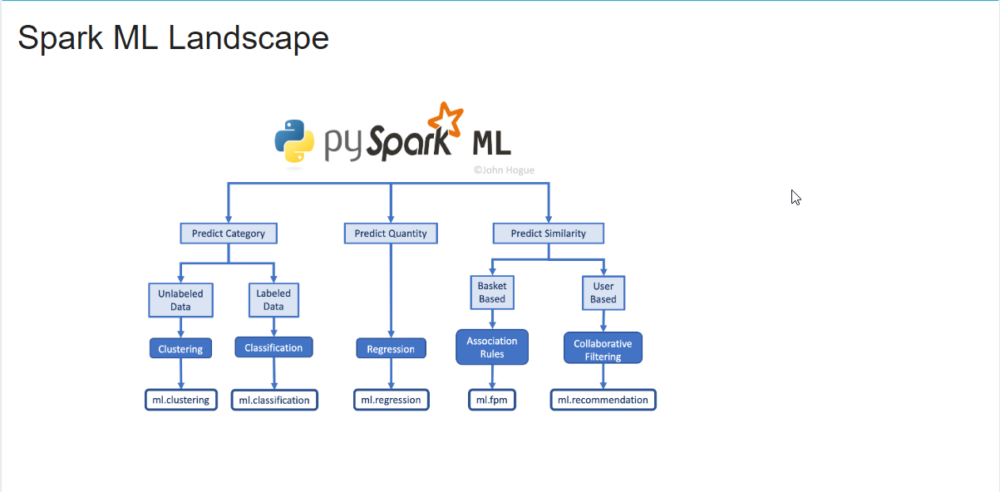

# Feature Engineering with PySpark
## John Hogue

# Exploratory Data Analysis
- **Feature Engineering** is using domain knowledge to help our models perform better.
- While this class will be useful, don't just copy/paste.
- Before modeling, spend time defining your goals.
- Make sure to research your data and understand its limitations.
- Still be willing to ask interesting or challenging questions.
- The **Data Science Process** is:
  * Project Scoping/Data Collection.
  * Exploratory Analysis.
  * Data Cleaning.
  * Feature Engineering.
  * Model Training.
  * Project Delivery/Insights.
- This is a loop and not really ordered.
- As an aside, make sure to keep up with Spark's Documentation.
- You can check your version of spark using:
```python
spark.version

import sys
sys.version_info
```
- We'll be using a *Parquet File* for the data.
- This format is columnar; meaning organized by columns.
- They're also defined and typed.
- There are many different input file types:
```python
# JSON
spark.read.json('example.json')
 # CSV or delimited files
spark.read.csv('example.csv')
 # Parquet
spark.read.parquet('example.parq')
 # Read a parquet file to a PySpark DataFrame
df = spark.read.parquet('example.parq')
```
- You can print the columns of a dataframe in spark like in pandas:
```python
# Print columns in dataframe
print(df.columns)
```
- The first step is to *formally define your problem*.
- Next, we need to take into consideration the limitations of the data we have.
- Then, we check over our given attributes.
- You can get the number of rows using the function `df.count()`.
- You can take the length of the columns using `len( df.columns )`.
- Make sure that the data types are what you expect them to be.
- You can check using `df.dtypes` to get a list of tuples of (Name, type).
- You can display a column's summary statistics using:
```python
# Display summary statistics
Y_df.describe().show()
```
- In the field, you will be dealing with "less than ideal" data.
- Since the function `mean()` is considered an aggregate function, it will need to be passed with the function `df.agg()`.
```python
df.agg({'SALESCLOSEPRICE': 'mean'}).collect()
```

- You use the function `.collect()` to force it to return a result now.
- The function `cov()` allows us to check the covariance of two attributes.
- You should explore your data with plots and the library **Seaborn** is the default.
- To do this though, you will need to convert the PySpark Dataframe to a Pandas dataframe.
- You can convert a Pyspark dataframe to pandas using `.toPandas()`
- You can use the function `sample()` to assist with getting a representative sample of data.
```python
# Sample 50% of the PySpark DataFrame and count rows; replacement off
df.sample(False, 0.5, 42).count()
```
```python
# Import your favorite visualization library
import seaborn as sns
# Sample the dataframe
sample_df = df.select(['SALESCLOSEPRICE']).sample(False, 0.5, 42)
# Convert the sample to a Pandas DataFrame
pandas_df = sample_df.toPandas()
# Plot it
sns.distplot(pandas_df)
```
```python
# Check the correlation of a pair of columns
corr_val = df.corr('SALESCLOSEPRICE', col)
```
```python
# Import skewness function
from pyspark.sql.functions import skewness

# Compute and print skewness of LISTPRICE
print(df.agg({'LISTPRICE': 'skewness'}).collect())
```

# Wrangling with Spark Functions
- Garbage in, Garbage Out Mantra.
- Issues that can crop up with data:
  * Recorded wrong.
  * Unique events.
  * Formatted Incorrectly.
  * Duplications.
  * Missing.
  * Data not relevant.
- You can drop columns using the function `df.drop()`
```python
# List of columns to drop
cols_to_drop = ['NO', 'UNITNUMBER', 'CLASS']
# Drop the columns; don't forget the star.
df = df.drop(*cols_to_drop)
```
- You can filter text in a dataframe using:
  1. `.where()` by passing a condition.
  2. `.like()` is similar to SQL like for pattern matching.
  3. The `~` means logical not inside these conditions.
```
df = df.where(~df['POTENTIALSHORTSALE'].like('Not Disclosed'))
```
- It might be worth filtering Outliers.
- You can drop `NA` or `Null` values using the function `df.dropna()`
  * `.dropna()` by itself will drop any record that has any.
  * `.dropna( how=all, subset['col1', 'col2'])` will drop columns only if all of `col1` and `col2` have NAs.
  * `.dropna( thresh = 2)` will drop the record if `<n>` values are found.
- You can drop duplicate rows with the function `df.dropDuplicates()`.
- You can always pass a list of column names to limit the drop search to only certain columns.
```python
# Filter the text values out of df but keep null values
text_filter = ~df['ASSUMABLEMORTGAGE'].isin(yes_values) | df['ASSUMABLEMORTGAGE'].isNull()
df = df.where(text_filter)
```
- "Data does not give up its secrets easily; it must confess" *Jeff Huber*
- One way to deal with data is to scale it so that it's on the same scale.
- This is sometimes called **MinMax Scaling**
- **Standardization** is when you transform the data into a Standard Normal Distribution.
- One way to manage skewed data is to log transform it.
```
# import the log function
from pyspark.sql.functions import log
 # Recalculate log of SALESCLOSEPRICE
df = df.withColumn('log_SalesClosePrice', log(df['SALESCLOSEPRICE']))
```
```
# Compute the skewness
print(df.agg({"YEARBUILT": 'skewness'}).collect())
```
- There are a few kinds of different missing values:
  * **Missing Completely at Random**: just completely random.
  * **Missing at Random**: Missing conditionally at random based on another observation.
  * **Missing Not at Random**: Data is missing because of how it is collected.
- If you only have a few missing values and they're missing *completely at random* then it might be fine to remove the rows.
- You can also use visualizations to assist with reasoning about missing values:
```python
# Import library
import seaborn as sns
# subset the dataframe
sub_df = df.select(['ROOMAREA1'])
# sample the dataframe
sample_df = sub_df.sample(False, .5, 4)
# Convert to Pandas DataFrame
pandas_df = sample_df.toPandas()
# Plot it
sns.heatmap(data=pandas_df.isnull())
```
- Another way to deal with missing data is to do an Imputation of Missing Values.
- Make sure you **really** understand the data before even attempting to make decisions about imputing missing values.
- You can use the function `df.fillna()` to replace missing values:
```python
# Replacing missing values with zero
df.fillna(0, subset=['DAYSONMARKET'])

# Replacing with the mean value for that column
col_mean = df.agg({'DAYSONMARKET': 'mean'}).collect()[0][0]
df.fillna(col_mean, subset=['DAYSONMARKET'])
```
```python
# Sample the dataframe and convert to Pandas
sample_df = df.select( columns ).sample(False, 0.5, 42)
pandas_df = sample_df.toPandas()

# Convert all values to T/F
tf_df = pandas_df.isnull()

# Plot it
sns.heatmap(data=tf_df)
plt.xticks(rotation=30, fontsize=10)
plt.yticks(rotation=0, fontsize=10)
plt.show()
```
- Adding external data may add important predictors, but too many features might end up with spurious correlations.
- The extra data may supplement or replace values, but could also induce data leakage.
- Getting more data could be really cheap to include, but just means that you'll need domain expertise to understand it.
- There are a few ways to do joins, but will mostly be *Left* and *Inner* Joins.
- An example:
```python
DataFrame.join(
    other,      # Other DataFrame to merge
    on=None,    # The keys to join on
    how=None)   # Type of join to perform (default is 'inner')
```
- If you're more familiar with SQL statements, then *PySpark* provides the function `spark.sql()`:
```python
# Register the dataframe as a temp table
df.createOrReplaceTempView("df")
hdf.createOrReplaceTempView("hdf")

# Write a SQL Statement
sql_df = spark.sql("""
                      SELECT
                        *
                      FROM df
                      LEFT JOIN hdf
                      ON df.OFFMARKETDATE = hdf.dt
                   """)
```
```python
# Cast data types
walk_df = walk_df.withColumn('longitude', walk_df['longitude'].cast('double'))
walk_df = walk_df.withColumn('latitude', walk_df['latitude'].cast('double'))

# Round percision
df = df.withColumn('longitude', round(df['longitude'], 5))
df = df.withColumn('latitude', round(df['latitude'], 5))

# Create join condition
condition = [(df['longitude'] == walk_df['longitude']), (df['latitude'] == walk_df['latitude'])]

# Join the dataframes together
join_df = df.join(walk_df, on=condition, how='left')
# Count non-null records from new field
print(join_df.where(~join_df['walkscore'].isNull()).count())
```
```python
# Register dataframes as tables
df.createOrReplaceTempView("df")
walk_df.createOrReplaceTempView("walk_df")

# SQL to join dataframes
join_sql = 	"""
			SELECT
				*
			FROM df
			LEFT JOIN walk_df
			ON df.longitude = walk_df.longitude
			AND df.latitude = walk_df.latitude
			"""
# Perform sql join
joined_df = spark.sql(join_sql)
```


# Feature Engineering
- Simply because you have data and Machine Learning does not mean it can figure out everything itself.
- You can generate new features using Multiplication, Summing, Differencing and Dividing.
```python
# Linear model plots
sns.jointplot(x="Total_SQFT", y="SALESCLOSEPRICE", data=pandas_df, kind="reg", stat_func=r2)
plt.show()
sns.jointplot(x="BATHS_PER_1000SQFT", y="SALESCLOSEPRICE", data=pandas_df, kind="reg", stat_func=r2)
plt.show()
```
- We want to assist our model in managing cycles in data.
- You can convert to a data using the function `to_date()`.
- If you want to keep the timestamps, then use function `to_timestamp()`.
- You can also extract the year and month once in time format using the functions `year()` and `month()`.
- You can also get the day of the month or the week of the year with functions `dayofmonth()` and `yearofmonth()`.
- **Lagging Features** is for features where there is a time difference between when the impact is felt and the event.
- We will need the function `window()` to allow us to run an aggregation against a group of records.
- The function `lag()` will return the value that is `count` rows before the current row.
```python
from pyspark.sql.functions import lag
from pyspark.sql.window import Window
 # Create Window
w = Window().orderBy(m_df['DATE'])
 # Create lagged column
m_df = m_df.withColumn('MORTGAGE-1wk', lag('MORTGAGE', count=1).over(w))
 # Inspect results
m_df.show(3)
```
- You can calculate the difference between two dates using the function `datediff()`.
```python
# Calculate difference between date columns
mort_df = mort_df.withColumn('Days_Between_Report', datediff('DATE', 'DATE-1'))
# Print results
mort_df.select('Days_Between_Report').distinct().show()
```
- Extracting and creating a Boolean value form text can be done with the function `when()`
```python
# Create boolean filters
find_under_8 = df['ROOF'].like('%Age 8 Years or Less%')
find_over_8 = df['ROOF'].like('%Age Over 8 Years%')

# Apply filters using when() and otherwise()
df = df.withColumn('old_roof', (when(find_over_8, 1)
                               .when(find_under_8, 0)
                               .otherwise(None)))
```
- You can split a column using the function `split()`.
```python
# Put the first value of the list into a new column
df = df.withColumn('Roof_Material', split_col.getItem(0))
# Inspect results
df[['ROOF', 'Roof_Material']].show(5, truncate=100)
```
- **Exploding** is when you take the values from a split and duplicate the columns.

```python
from pyspark.sql.functions import split, explode, lit, coalesce, first

 # Split the column on commas into a list
df = df.withColumn('roof_list', split(df['ROOF'], ', '))

 # Explode list into new records for each value
ex_df = df.withColumn('ex_roof_list', explode(df['roof_list']))

 # Create a dummy column of constant value
ex_df = ex_df.withColumn('constant_val', lit(1))

 # Pivot the values into boolean columns
piv_df = ex_df.groupBy('NO').pivot('ex_roof_list').agg(coalesce(first('constant_val')))
```
- **Binarizing** is a great way to collapse some of the complexity of the features to YES or NO.
```python
from pyspark.ml.feature import Binarizer
 # Cast the data type to double
df = df.withColumn('FIREPLACES', df['FIREPLACES'].cast('double'))
 # Create binarizing transformer
bin = Binarizer(threshold=0.0, inputCol='FIREPLACES', outputCol='FireplaceT')
# Apply the transformer
df = bin.transform(df)
```
- **Bucketing** is a way to define ordinal values.
```python
from pyspark.ml.feature import Bucketizer
# Define how to split data
splits = [0, 1, 2, 3, 4, float('Inf')]
# Create bucketing transformer
buck = Bucketizer(splits=splits, inputCol='BATHSTOTAL', outputCol='baths')
# Apply transformer
df = buck.transform(df)
# Inspect results
df[['BATHSTOTAL', 'baths']].show(4)
```
- **One Hot Encoding** is where you pivot values in a column into their own TRUE/FALSE columns.
```python
from pyspark.ml.feature import OneHotEncoder, StringIndexer
# Create indexer transformer
stringIndexer = StringIndexer(inputCol='CITY', outputCol='City_Index')
 # Fit transformer
model = stringIndexer.fit(df)
# Apply transformer
indexed = model.transform(df)

# Create encoder transformer
encoder = OneHotEncoder(inputCol='City_Index', outputCol='City_Vec)

# Apply the encoder transformer
encoded_df = encoder.transform(indexed)

# Inspect results
encoded_df[['City_Vec']].show(4)
```
- Note that the last value in the list is not included since it is linearly dependent on the others.
- One Hot Encoding is a great way to handle categorial variables.
- The implementation in PySpark is different than Pandas `get_dummies()` as it puts everything into a single column of type vector rather than a new column for each value.
- It's also different from sklearn's OneHotEncoder in that the last categorical value is captured by a vector of all zeros.


# Building a Model
- While Spark has lots of different Algorithms for us to select from, the onus is on us to pick the right one.
- Here is a handy graph to assist:

- Running a Time Series analysis is harder since it leaks information from the future.
- We will need to adjust for this:
```python
# Create variables for max and min dates in our dataset
max_date = df.agg({'OFFMKTDATE': 'max'}).collect()[0][0]
min_date = df.agg({'OFFMKTDATE': 'min'}).collect()[0][0]
 # Find how many days our data spans
from pyspark.sql.functions import datediff
range_in_days = datediff(max_date, min_date)

# Find the date to split the dataset on
from pyspark.sql.functions import date_add
split_in_days = round(range_in_days * 0.8)
split_date = date_add(min_date, split_in_days)

# Split the data into 80% train, 20% test
train_df = df.where(df['OFFMKTDATE'] < split_date)
test_df = df.where(df['OFFMKTDATE'] >= split_date)\
  .where(df['LISTDATE'] >= split_date)
```
- This example will use the lit() function. This function is used to allow single values where an entire column is expected in a function call.
```python
from pyspark.sql.functions import datediff, to_date, lit

split_date = to_date(lit('2017-12-10'))
# Create Sequential Test set
test_df = df.where(df["OFFMKTDATE"] >= split_date).where(df["LISTDATE"] <= split_date)

# Create a copy of DAYSONMARKET to review later
test_df = test_df.withColumn('DAYSONMARKET_Original', test_df['DAYSONMARKET'])

# Recalculate DAYSONMARKET from what we know on our split date
test_df = test_df.withColumn('DAYSONMARKET', datediff(split_date, "LISTDATE"))

# Review the difference
test_df[['LISTDATE', 'OFFMKTDATE', 'DAYSONMARKET_Original', 'DAYSONMARKET']].show()
```
- Each Machine Learning Algorithm has its own assumptions that you need to take into account when building models.
- PySpark Machine Learning Algos expect the features to all be in one column of type **Vector**.
- Sadly, while Regression Trees can handle missing values, Vectors cannot.
- We can just replace the missing values with something outside the variables to tell it to ignore it.
```python
from pyspark.ml.feature import VectorAssembler
 # Replace Missing values
df = df.fillna(-1)

# Define the columns to be converted to vectors
features_cols = list(df.columns)
 # Remove the dependent variable from the list
features_cols.remove('SALESCLOSEPRICE')

# Create the vector assembler transformer
vec = VectorAssembler(inputCols=features_cols, outputCol='features')
# Apply the vector transformer to data
df = vec.transform(df)
# Select only the feature vectors and the dependent variable
ml_ready_df = df.select(['SALESCLOSEPRICE', 'features'])
# Inspect Results
ml_ready_df.show(5)
```
```python
# Replace missing values
df = df.fillna(-1, subset=['WALKSCORE', 'BIKESCORE'])

# Create list of StringIndexers using list comprehension
indexers = [StringIndexer(inputCol=col, outputCol=col+"_IDX")\
            .setHandleInvalid("keep") for col in categorical_cols]
# Create pipeline of indexers
indexer_pipeline = Pipeline(stages=indexers)
# Fit and Transform the pipeline to the original data
df_indexed = indexer_pipeline.fit(df).transform(df)

# Clean up redundant columns
df_indexed = df_indexed.drop(*categorical_cols)
# Inspect data transformations
print(df_indexed.dtypes)
```
- There are some parameters that you will need to pass to our Model:
  * `featureCol` for the feature data.
  * `labelCol` which sets the dependent variable.
  * `predictionCol` for the name we can to call the prediction result column.
  * `seed` to ensure that the model is reproducible.
```python
from pyspark.ml.regression import RandomForestRegressor
 # Initialize model with columns to utilize
rf = RandomForestRegressor(featuresCol="features",
                           labelCol="SALESCLOSEPRICE",
                           predictionCol="Prediction_Price",
                           seed=42
                           )
 # Train model
model = rf.fit(train_df)
```
- To make predictions now, we just call `model.transform(<test_df>)`; or, new data that we have.
- You will just need to apply the same preprocessing to new data.
- To evaluate the model, we will need the function `RegressionEvaluator`.
- Once the *Evaluator* object is created, we can then metrics against it.
```python
from pyspark.ml.evaluation import RegressionEvaluator
 # Select columns to compute test error
evaluator = RegressionEvaluator(labelCol="SALESCLOSEPRICE",
                                predictionCol="Prediction_Price")
 # Create evaluation metrics
rmse = evaluator.evaluate(predictions, {evaluator.metricName: "rmse"})
r2 = evaluator.evaluate(predictions, {evaluator.metricName: "r2"})
```
```python
from pyspark.ml.evaluation import RegressionEvaluator

# Select columns to compute test error
evaluator = RegressionEvaluator(labelCol="SALESCLOSEPRICE",
                                predictionCol="Prediction_Price")
# Dictionary of model predictions to loop over
models = {'Gradient Boosted Trees': gbt_predictions, 'Random Forest Regression': rfr_predictions}
for key, preds in models.items():
  # Create evaluation metrics
  rmse = evaluator.evaluate(preds, {evaluator.metricName: "rmse"})
  r2 = evaluator.evaluate(preds, {evaluator.metricName: "r2"})
```
- Now we'll move on to intepreting the model.
- Doing this in Spark would be overkillself.
```python
import pandas as pd
 # Convert feature importances to a pandas column
fi_df = pd.DataFrame(model.featureImportances.toArray(),
                     columns=['importance'])
 # Convert list of feature names to pandas column
fi_df['feature'] = pd.Series(feature_cols)
 # Sort the data based on feature importance
fi_df.sort_values(by=['importance'], ascending=False, inplace=True)
```
- You can easily save your model using then function `model.save('a-name')`.
- To import a model, you will need the necessary model that you used to build it first.
```python
from pyspark.ml.regression import RandomForestRegressionModel

# Load model from
model2 = RandomForestRegressionModel.load('rfr_real_estate_model')
```

# Research:
- FeatureTools package.
- TSFresh package.


# Reference:
