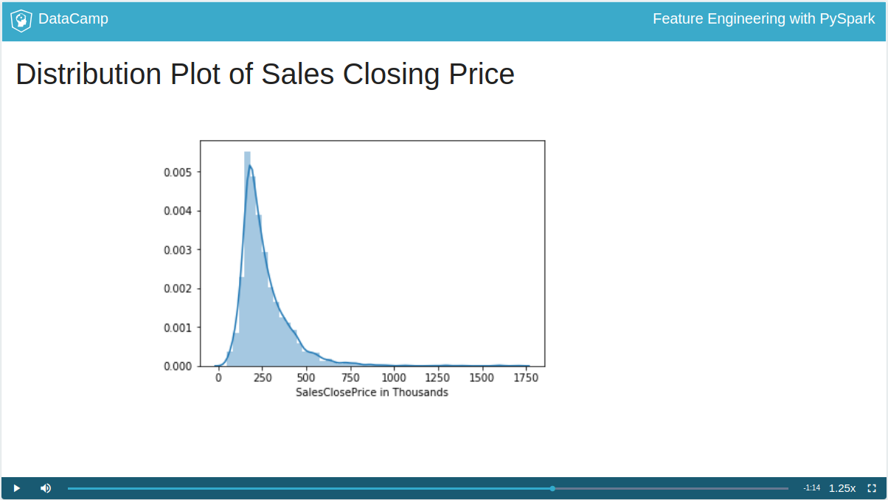

# Feature Engineering with PySpark
## John Hogue

# Exploratory Data Analysis
- **Feature Engineering** is using domain knowledge to help our models perform better.
- While this class will be useful, don't just copy/paste.
- Before modeling, spend time defining your goals.
- Make sure to research your data and understand its limitations.
- Still be willing to ask interesting or challenging questions.
- The **Data Science Process** is:
  * Project Scoping/Data Collection.
  * Exploratory Analysis.
  * Data Cleaning.
  * Feature Engineering.
  * Model Training.
  * Project Delivery/Insights.
- This is a loop and not really ordered.
- As an aside, make sure to keep up with Spark's Documentation.
- You can check your version of spark using:
```python
spark.version

import sys
sys.version_info
```
- We'll be using a *Parquet File* for the data.
- This format is columnar; meaning organized by columns.
- They're also defined and typed.
- There are many different input file types:
```python
# JSON
spark.read.json('example.json')
 # CSV or delimited files
spark.read.csv('example.csv')
 # Parquet
spark.read.parquet('example.parq')
 # Read a parquet file to a PySpark DataFrame
df = spark.read.parquet('example.parq')
```
- You can print the columns of a dataframe in spark like in pandas:
```python
# Print columns in dataframe
print(df.columns)
```
- The first step is to *formally define your problem*.
- Next, we need to take into consideration the limitations of the data we have.
- Then, we check over our given attributes.
- You can get the number of rows using the function `df.count()`.
- You can take the length of the columns using `len( df.columns )`.
- Make sure that the data types are what you expect them to be.
- You can check using `df.dtypes` to get a list of tuples of (Name, type).
- You can display a column's summary statistics using:
```python
# Display summary statistics
Y_df.describe().show()
```
- In the field, you will be dealing with "less than ideal" data.
- Since the function `mean()` is considered an aggregate function, it will need to be passed with the function `df.agg()`.
```python
df.agg({'SALESCLOSEPRICE': 'mean'}).collect()
```

- You use the function `.collect()` to force it to return a result now.
- The function `cov()` allows us to check the covariance of two attributes.
- You should explore your data with plots and the library **Seaborn** is the default.
- To do this though, you will need to convert the PySpark Dataframe to a Pandas dataframe.
- You can convert a Pyspark dataframe to pandas using `.toPandas()`
- You can use the function `sample()` to assist with getting a representative sample of data.
```python
# Sample 50% of the PySpark DataFrame and count rows; replacement off
df.sample(False, 0.5, 42).count()
```
```
# Import your favorite visualization library
import seaborn as sns
# Sample the dataframe
sample_df = df.select(['SALESCLOSEPRICE']).sample(False, 0.5, 42)
# Convert the sample to a Pandas DataFrame
pandas_df = sample_df.toPandas()
# Plot it
sns.distplot(pandas_df)
```
```
# Check the correlation of a pair of columns
corr_val = df.corr('SALESCLOSEPRICE', col)
```
```
# Import skewness function
from pyspark.sql.functions import skewness

# Compute and print skewness of LISTPRICE
print(df.agg({'LISTPRICE': 'skewness'}).collect())
```

# Wrangling with Spark Functions

# Feature Engineering

# Building a Model

# Research:

# Reference:
