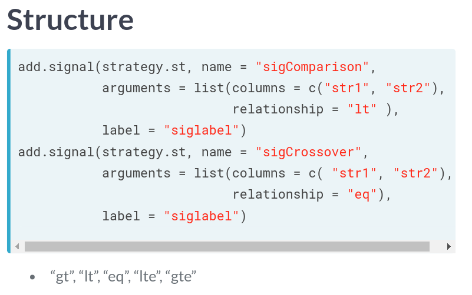

# Financial Trading in R
## Ilya Kipnis

# Trading Basics
- **Trading** is the act of buying or selling an asset.
- They do this to:
  1. Make a profit.
  2. Take on, offload or hedge Financial Risk.
  3. Protect a company from commodity price movements.
- The plan of **Systematic Trading** is the risk/reward payoff is favorable enough to bear the risk.
- There are two kinds of trading:
  1. Divergence: the movement of a quntity will continue in its current direction.
    * **Commodity Trading Advisers(CTAs)** are who think like this.
  2. Convergence: the movement of a quantity will eventually reverse.
- The package that we'll be using has a dependency:
```
install.packages('remotes')
remotes::install_github("braverock/quantstart")
```
- Market data is a mix of fear, greed and noise of millions.
- **Past Performance is not indicative of future results.**.
- **Overfitting** on past data means bad performance on future data.
- A system should behave similarly for similar settings levels.
- The first step is to actually get financial data.
- We'll be using the function `getSymbols()` from the quantmod package.
- The `quantmod` function has these to access the columns of the data pulled:
  * `Op()` for open prices.
  * `Hi()` for maximum value for the day.
  * `Lo()` for minimum value for the day.
  * `Cl()` for the closing price for the day.
  * `Vo()` for number of trades that day.
  * `Ad()` adjusted closing price.
```
# Get SPY from yahoo
getSymbols("SPY",
           from = '2000-01-01',
           to = '2016-06-30',
           src =  "yahoo",
           adjust =  TRUE)

# Plot the closing price of SPY
plot(Cl(SPY))
```
- the TTR package contains lots of classical trading indicators.
- An example would be a **Simple Moving Average**.
- Some CTAs have made money using the 200 day moving average.
  * It shows where the prices have been over the last 10 months.
```
# Plot the closing prices of SPY
plot(Cl(SPY))

# Add a 200-day SMA using lines()
lines(SMA(Cl(SPY), n = 200), col = 'red')
```


# A Biolerplate for Quantstrat Strategies
- There are three important dates for the strategy:
  1. The initial date.
  2. A from date.
  3. A to date.
- To properly align the dates, it needs to know what timezone it's in.
- You will need to set this using: `Sys.setenv(TZ = 'UTC')`
- Then we have to tell it what currency to use: `currency("USD")`.
- Using the function `stock()` to tell it to treat the stock as basic equity.
```
stock("LQD", currency = "USD", multiplier = 1)
```
- Examples:
```
# Load the quantstrat package
library(quantstrat)

# Create initdate, from, and to strings
initdate <- "1999-01-01"
from <- "2003-01-01"
to <- "2015-12-31"

# Set the timezone to UTC
Sys.setenv(TZ = "UTC")

# Set the currency to USD
currency("USD")
```
- In `quantstrat` trade size and initial equity are important to work in "Return Space."
- Working in trade-space allows for more functionality than "P-L-Space"
- We will need to also initialize:
  1. The account.
  2. The Portfolio.
  3. The Strategy.
- If a strategy already exists, then it cannot be re-run!
- You will need to remove it with `rm.strat( strategy.st )`.
- Now to initialize all the items.
- You initialize the portfolio using `initPortf()`:
```
initPortf(portfolio.st, symbols = "LQD", initDate = initDate, currency = "USD")

```
- Next, you initialize the account with `initAcct()`:
```
initAcct( account.st, portfolios = portfolio.st, initDate = initDate, currency="USD", initEq = initEq)
```
- ... where `account.st` is the account and `initEq` is the inital equity.
- Next we initialize the Orders using `initOrders()`:
```
initOrders(portfolio.st, initDate=initDate)
```
- Then, you initialize the strategy with `strategy(strategy.st, store = TRUE)`.


# Indicators
- Markets are exceptionally noisy.
- **Indicators** are transformations of market data.
- Better indicators try to have more smoothness without sacrificing responsiveness.
- The most common is the 200-day moving average.
- Another is the **Relative Strength Indicator (RSI)**.
- This is a kind of **Osscilation Indicator** which is centered around 0.
- This indicator we're building is not in a package to prove you are only limited by what you can think of.
```
# Create a 200-day SMA
spy_sma <- SMA(x = Cl(SPY), n=200)

# Create an RSI with a 3-day lookback period
spy_rsi <- RSI(price = Cl(SPY), n=3)
```
- The function to add an indicator to a strategy is `add.indicator()`.
- It requires:
  1. The name of your strategy.
  2. The name of  the function your indicator will call.
  3. The inputs for the function as a list.
- Examples:
```
# Add a 200-day SMA indicator to strategy.st
add.indicator(strategy = strategy.st,

              # Add the SMA function
              name = "SMA",

              # Create a lookback period
              arguments = list( quote(Cl(mktdata)), n=200),

              # Label your indicator SMA200
              label = 'SMA200')
```            
- It is good practice to use descriptive names.
- You can use the function `applyIndicators()` to test the indicators on test data.
```
# Declare the DVO function
DVO <- function(HLC, navg = 2, percentlookback = 126) {

  # Compute the ratio between closing prices to the average of high and low
  ratio <- Cl(HLC)/((Hi(HLC) + Lo(HLC))/2)

  # Smooth out the ratio outputs using a moving average
  avgratio <- SMA(ratio, n = navg)

  # Convert ratio into a 0-100 value using runPercentRank()
  out <- runPercentRank(avgratio, n = percentlookback, exact.multiplier = 1) * 100
  colnames(out) <- "DVO"
  return(out)
}

# Add the DVO indicator to your strategy
add.indicator(strategy = strategy.st, name = "DVO",
              arguments = list(HLC = quote(HLC(mktdata)), navg = 2, percentlookback = 126),
              label = "DVO_2_126")

# Use applyIndicators to test out your indicators
test <- applyIndicators(strategy = strategy.st, mktdata = OHLC(mktdata))

# Subset your data between Sep. 1 and Sep. 5 of 2013
test_subset <- test["2013-09-01/2013-09-05"]
```


# Signals
- **Signals** are the interactions of market data with indicators or indicators with other indicators.
- These may sound complicated but they are similar to and simpler than indicators.
- The function that will be used for this is `add.signal()`.
- There are four common signals:
  * **sigComparison**: Relationship between two indicators; returns 1 if relationship is true.
  * **sigCrossover**: similar to *sigComparison*; returns 1 on the first occurrence.
  * **sigThreshold**: Compares range-bound indicator to a static quantity.
  * **sigFormula**: Flexible Signal creation.

```
# Add a sigComparison which specifies that SMA50 must be greater than SMA200, call it longfilter
add.signal(strategy.st, name = "sigComparison",

           # We are interested in the relationship between the SMA50 and the SMA200
           arguments = list(columns = c("SMA50", "SMA200"),

                            # Particularly, we are interested when the SMA50 is greater than the SMA200
                            relationship = "gt"),

           # Label this signal longfilter
           label = "longfilter")
```
```
# Implement a sigThreshold which specifies that DVO_2_126 must be less than 20, label it longthreshold
add.signal(strategy.st, name = "sigThreshold",

           # Use the DVO_2_126 column
           arguments = list(column = "DVO_2_126",

                            # The threshold is 20
                            threshold = 20,

                            # We want the oscillator to be under this value
                            relationship = "lt",

                            # We're interested in every instance that the oscillator is less than 20
                            cross = FALSE),

           # Label it longthreshold
           label = "longthreshold")
```


# Rules

# Research:

# Reference:
