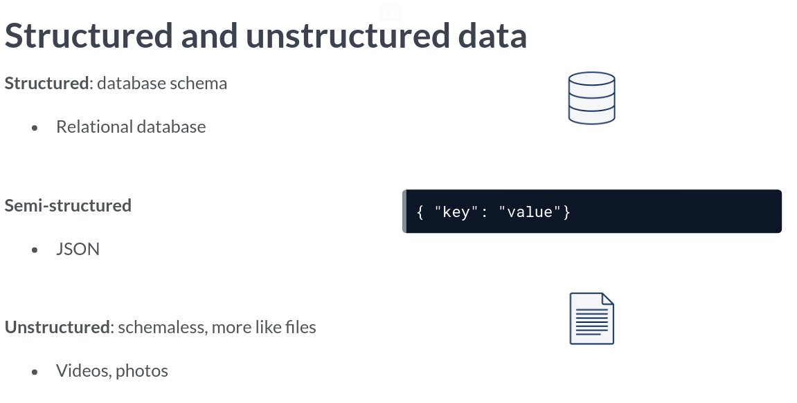
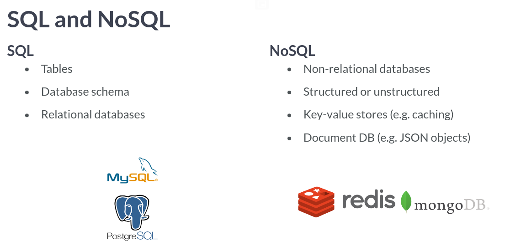
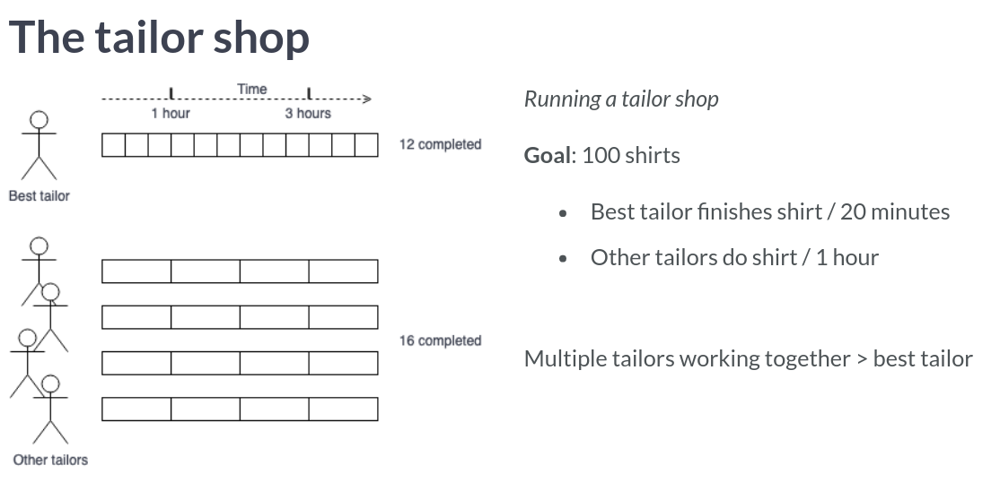

# Introduction to Data Engineering
## Vincent Vankrunkelsven

# Introduction to Data Engineering
- It is the **Data Engineer's Job** to make the data analysis job easier.
- They are focused on tasks such as:
  * Gathering data from different sources.
  * Optimized databases for Analyses.
  * Remove corrupted data.
- A more formal definition is someone who develops, constructs, tests and maintains architectures such as databases and large scale processing systems.

- Data engineers are expert users of databases.
- A **Database** holds large amounts of data.
- Processing data includes:
  * Cleaning data.
  * Aggregating data.
  * Join data.
- It is also the Data Engineer's job to plan jobs with specific intervals.
- Sometimes jobs must be done in a particular order so you will need to resolve dependency requirements of jobs.
- There are lots of different tools for these jobs:

- Data Engineers are heavy users of the cloud.
- This is because maintaining in-house infrastructure is expensive and hard to maximize.
- There are three big players in the Cloud:
  1. AWS.
  2. Azure.
  3. Google Cloud
- While there are a lot of services they provide, the three most relevant to a Data Engineer are:
  1. Storage.
  2. Computation.
  3. Databases.


# Data Engineering Toolbox
- A **Database** is usually a large collection of data storage organized especially for rapid search and retrieval.
- The main difference between Databases and file systems is the level of organization.
- There are two primary kinds of databases: **Structured vs Unstructured**.

- We also talk about them in the terms SQL vs NoSQL databases.

- In Datawarehouses, it is common to see a **Star Schema**.
- This is defined as consisting of one or more fact tables referencing any number of dimension tables.
```sql
# Complete the SELECT statement
data = pd.read_sql("""
SELECT * FROM "Customer"
INNER JOIN "Order"
ON "Order"."customer_id"="Customer"."id"
""", db_engine)

# Show the id column of data
print(data.id)
```
- Parallel computing is the basis of almost all modern data processing tools.
- The reason for this is processing power and memory: mostly memory.
- The processing tools split tasks into sub tasks and distribute them across multiple computers.

- There are some risks, of course:
  1. There is overhead due to the need for communication.
  2. Tasks do not increase linearly as you throw more compute at something: **Parallel Slowdown**.
- Here is an example of paralleliz-ing in Python:
```python
from multiprocessing import Pool

def take_mean_age(year_and_group):
  year, group = year_and_group
  return pd.DataFrame({"Age": group['Age'].mean()}, index = [year])

with Pool(4) as p:
  results = p.map(take_mean_age, athlete_events.groupby("Year"))

results_df = pd.concat(results)
```
- There are packages that assist with allowing one to not have to write such low level code.
- One such package is *dask*.
```python
import dask.dataframe as dd

# Partition dataframe into 4 parts:
athlete_events_dask = dd.from_pandas(athlete_events, npartitions = 4)

# Run parallel computations on each partition:
result_df = athlete_events_dask.groupby('Year').Age.mean().compute()
```
- Example of timing with different pool sizes:
```python
# Function to apply a function over multiple cores
@print_timing
def parallel_apply(apply_func, groups, nb_cores):
    with Pool(nb_cores) as p:
        results = p.map(apply_func, groups)
    return pd.concat(results)

# Parallel apply using 1 core
parallel_apply(take_mean_age, athlete_events.groupby('Year'), 1)

# Parallel apply using 2 cores
parallel_apply(take_mean_age, athlete_events.groupby('Year'), 2)

# Parallel apply using 4 cores
parallel_apply(take_mean_age, athlete_events.groupby('Year'), 4)
```
- If you've done any looking, then you've heard of Hadoop.
- There are two projects we'll be talking about: MapReduce and HDFS.
- Firstly, **HDFS** is a distributed file system.
- **MapReduce** is similar to what was talked about with splitting the tasks up.
- A flaw was that it was hard to write the jobs to run.
- One solution to that problem was **HIVE**.
- It runs on *Hadoop* and uses a Structured Query Language.
- **Apache Spark** is a distributed compute project which tries to keep as much in memory as possible.
- *Spark* relies on what are called **Resilient Distributed Datasets (RDD)**.
- You can think of them as lists of tuples.
- You can use two operations on these:
  1. Transformations.
  2. Actions.
- When working with *Spark*, people use a programming language API like PySpark.
```python
rom pyspark.sql import SparkSession


if __name__ == "__main__":
    spark = SparkSession.builder.getOrCreate()
    athlete_events_spark = (spark
        .read
        .csv("/home/repl/datasets/athlete_events.csv",
             header=True,
             inferSchema=True,
             escape='"'))

    athlete_events_spark = (athlete_events_spark
        .withColumn("Height",
                    athlete_events_spark.Height.cast("integer")))

    print(athlete_events_spark
        .groupBy('Year')
        .mean('Height')
        .orderBy('Year')
        .show())
```
- Now we'll discuss the workflow scheduling frameworks.
- You could run the job daily, manually but that's not efficient.
- You could maybe use cron in linux but this will not take into account dependencies in jobs.
- To help visualize this we can use a **Directed Acyclical Graph (DAG)**.
- These have the attributes:
  * Set of nodes.
  * Directed Edges.
  * No cycles.
- While some companies use `cron`, you could also use Spotifies Luigi.
- For the remainder of the video, we'll be talking about Apache Airflow.
```python
# Create the DAG object
dag = DAG(dag_id="car_factory_simulation",
          default_args={"owner": "airflow","start_date": airflow.utils.dates.days_ago(2)},
          schedule_interval="0 * * * *")

          # Task definitions
          assemble_frame = BashOperator(task_id="assemble_frame", bash_command='echo "Assembling frame"', dag=dag)
          place_tires = BashOperator(task_id="place_tires", bash_command='echo "Placing tires"', dag=dag)
          assemble_body = BashOperator(task_id="assemble_body", bash_command='echo "Assembling body"', dag=dag)
          apply_paint = BashOperator(task_id="apply_paint", bash_command='echo "Applying paint"', dag=dag)

          # Complete the downstream flow
          assemble_frame.set_downstream(place_tires)
          assemble_frame.set_downstream(assemble_body)
          assemble_body.set_downstream(apply_paint)
```


# Extract, Transform, Load ( ETL )

# Case Study: Datacamp

# Research:
- `@print_timing`?


# Reference
