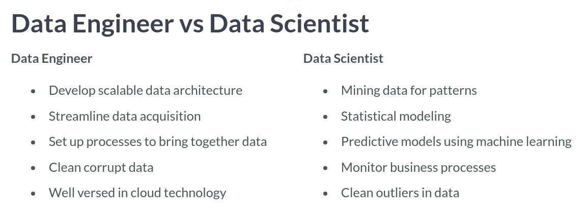
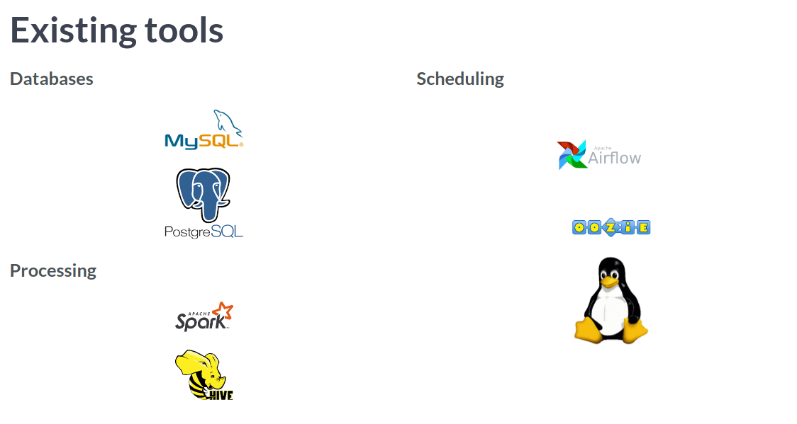

# Introduction to Data Engineering
## Vincent Vankrunkelsven

# Introduction to Data Engineering
- It is the **Data Engineer's Job** to make the data analysis job easier.
- They are focused on tasks such as:
  * Gathering data from different sources.
  * Optimized databases for Analyses.
  * Remove corrupted data.
- A more formal definition is someone who develops, constructs, tests and maintains architectures such as databases and large scale processing systems.

- Data engineers are expert users of databases.
- A **Database** holds large amounts of data.
- Processing data includes:
  * Cleaning data.
  * Aggregating data.
  * Join data.
- It is also the Data Engineer's job to plan jobs with specific intervals.
- Sometimes jobs must be done in a particular order so you will need to resolve dependency requirements of jobs.
- There are lots of different tools for these jobs:

- Data Engineers are heavy users of the cloud.
- This is because maintaining in-house infrastructure is expensive and hard to maximize.
- There are three big players in the Cloud:
  1. AWS.
  2. Azure.
  3. Google Cloud
- While there are a lot of services they provide, the three most relevant to a Data Engineer are:
  1. Storage.
  2. Computation.
  3. Databases.

# Data Engineering Toolbox

# Extract, Transform, Load ( ETL )

# Case Study: Datacamp

# Research:

# Reference
