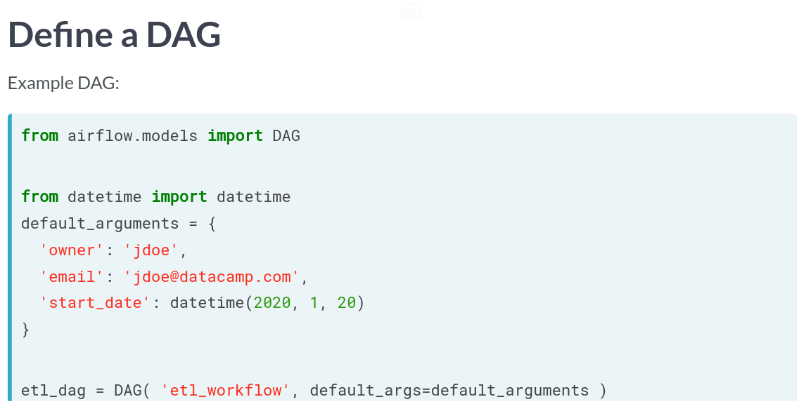
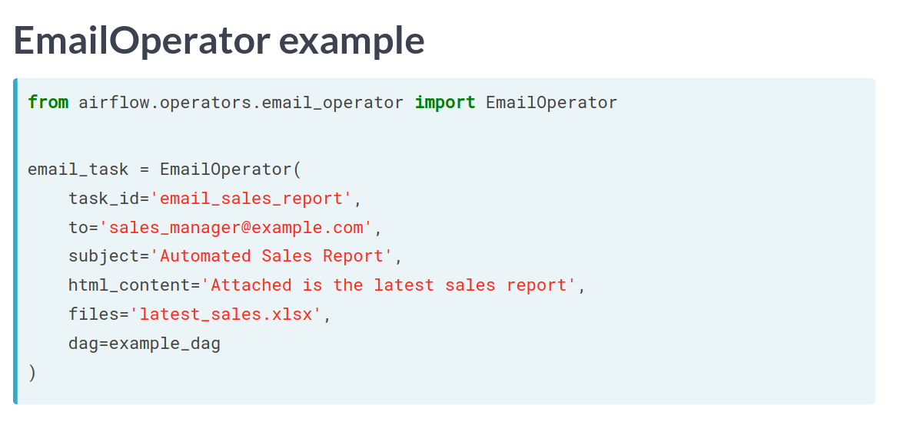
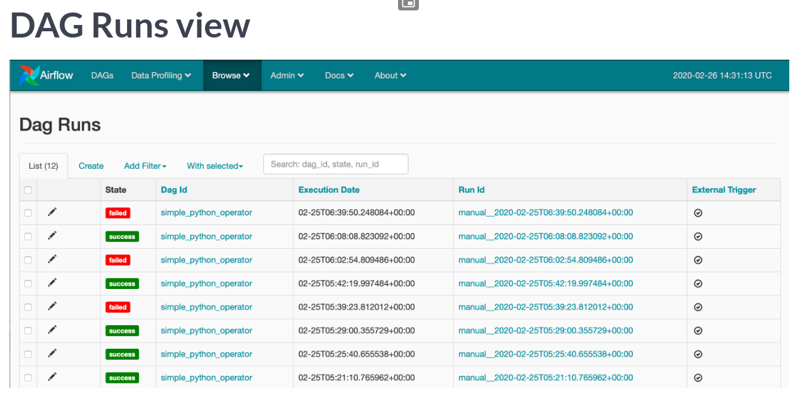
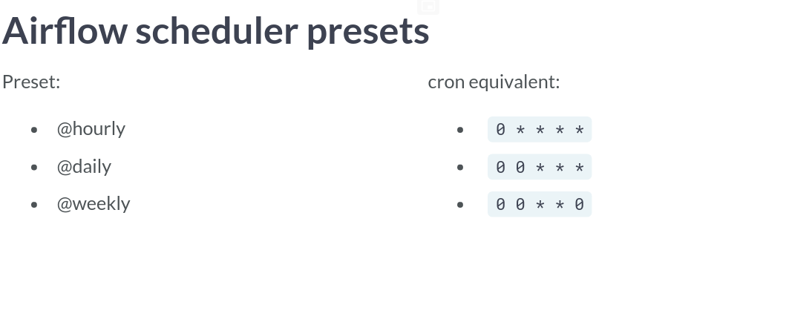
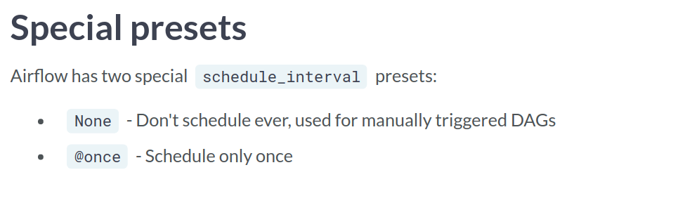

# Introduction to Airflow in Python
## Mike Metzger

# Intro to Airflow
- **Data Engineering** is taking any action involving data and turning it into a reliable, repeatable and maintainanble process.
- A **Workflow** is a set of steps to accomplish a given data engineering task.
- Apache Airflow is a platform to program workflows in general.
- They are implemented as **Directed Acyclical Graphs**.
There are other tools as well:
  * Luigi
  * SSIS
  * Bash Scripting.
- An example of a simple dag is:
```python
etl_dag = DAG(
  dag_id = 'etl_pipeline',
  default_args = {'start_date': "2020-01-08"}
)
```
- There are multiple ways to run dags but the easiest is via the command line:
```bash
airflow run <dag_id> <task_id> <start_date>
# airflow run example-etl download-file 2020-01-10
```
- DAGs have the attributes:
  1. It is directed; meaning there is an inherent flow.
  2. It does not loop or repeat.
  3. Graph is the representation of the compenents.

- You can get the list of subcommands at the command line using `airflow -h`.
- You can see all recognized dags using `airflow list_dags`.
- Example Dag:
```python
# Import the DAG object
from airflow.models import DAG

# Define the default_args dictionary
default_args = {
  'owner': 'dsmith',
  'start_date': datetime(2020, 1, 14),
  'retries': 2
}

# Instantiate the DAG object
etl_dag = DAG(dag_id='example_etl', default_args=default_args)
```
- You'll spend most of your time on the **Dags Page**.
- The **Dag Detial View** gives us specific details about the dag task.


# Implementing Airflow DAGs
- **Airflow Operators** represent a single task in a workflow.
- The `BashOperator` requires three arguments:
  1. `task_id`; the name in the UI
  2. `bash_command`; the raw command or script
  3. `dag`; the actual DAG it's attached to.
- Try not to use Environmental variables since they're not going to be defined.
- Can be tricky to run tasks with elevated privileges.
```python
# Import the BashOperator
from airflow.operators.bash_operator import BashOperator

# Define the BashOperator
cleanup = BashOperator(
    task_id='cleanup_task',
    # Define the bash_command
    bash_command='cleanup.sh',
    # Add the task to the dag
    dag=analytics_dag
)
```
- Tasks are instantiated operators.
- Task dependencies are not required for a workflow but are usually present.
- Tasks are usually referred to as **Upstream** or **Downstream** depending on its relationship to other tasks.
- Since 1.8, tasks are defined using the bit shift operators:
  * `>>`: Upstream
  * `<<`: Downstream
- Examples:
```python
# Set pull_sales to run prior to cleanup
pull_sales >> cleanup

# Configure consolidate to run after cleanup
consolidate << cleanup

# Set push_data to run last
consolidate >> push_data
```
- the `PythonOperator()` is like the bash version but instead expects python code.
- Print statements end up in the logs.
- You can pass a `opt_kwargs` defined dictionary to pass values to the functions.
```python
def sleep(length_of_time):
  time.sleep( length_of_time)

sleep_task = PythonOperator(
  task_id='sleep',
  python_callable='sleep',
  op_kwargs = {'length_of_time':5},
  dag=example_dag
)
```
- There are other operators in the ecosystem.
- One such is the `EmailOperator` from the `airflow.operators` sublibrary.

```python
# Import the Operator
from airflow.operators.email_operator import EmailOperator

# Define the task
email_manager_task = EmailOperator(
    task_id='email_manager',
    to ='manager@datacamp.com',
    subject='Latest sales JSON',
    html_content='Attached is the latest sales JSON file as requested.',
    files='parsedfile.json',
    dag=process_sales_dag
)

# Set the order of tasks
pull_file_task >> parse_file_task >> email_manager_task
```
- A **GAG Run** is a specific instance of a workflow at a point in time.
- It can be run manually or scheduled via the parameter `schedule_interval`
- You can see all the dag runs under the Browse Page:

- There are some attributes that we should be aware of while building runs:
  * `start_date`: when the Dag is allowed to start running.
  * `end_date`: An optional argument which can define when it should stop being scheduled.
  * `max_tries`: Optional attribute for how many attempts to make.
  * `schedule_interval`: defines how often the dag shoudl run.
- The actual schedule can be defined using the cron sytle syntax or prebuilt presets.
- Some presets are:


- Remember that the `state_date` is exclusive and not inclusive.
```python
# Update the scheduling arguments as defined
default_args = {
  'owner': 'Engineering',
  'start_date': datetime(2019, 11, 1),
  'email': ['airflowresults@datacamp.com'],
  'email_on_failure': False,
  'email_on_retry': False,
  'retries': 3,
  'retry_delay': timedelta(minutes=20)
}

dag = DAG('update_dataflows', default_args=default_args, schedule_interval='30 12 * * 3')
```


# Maintaining and monitoring Airflow workflows

# Building production pipelines in Airflow

# Review:

# Reference:
