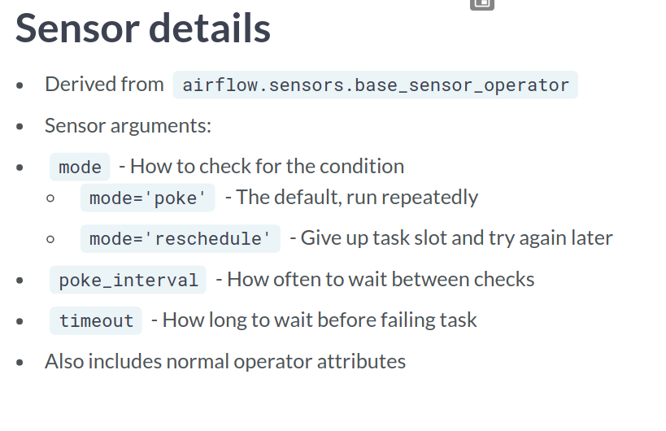
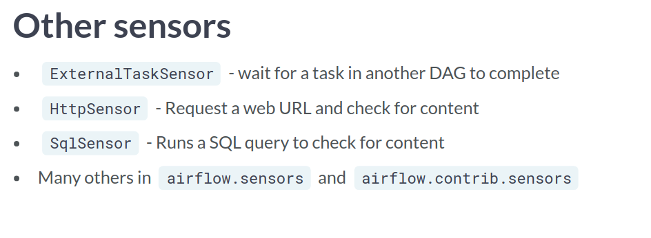
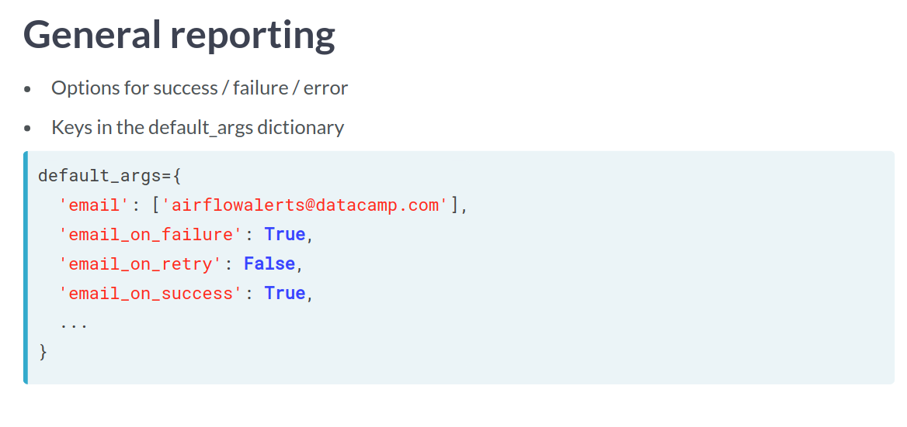
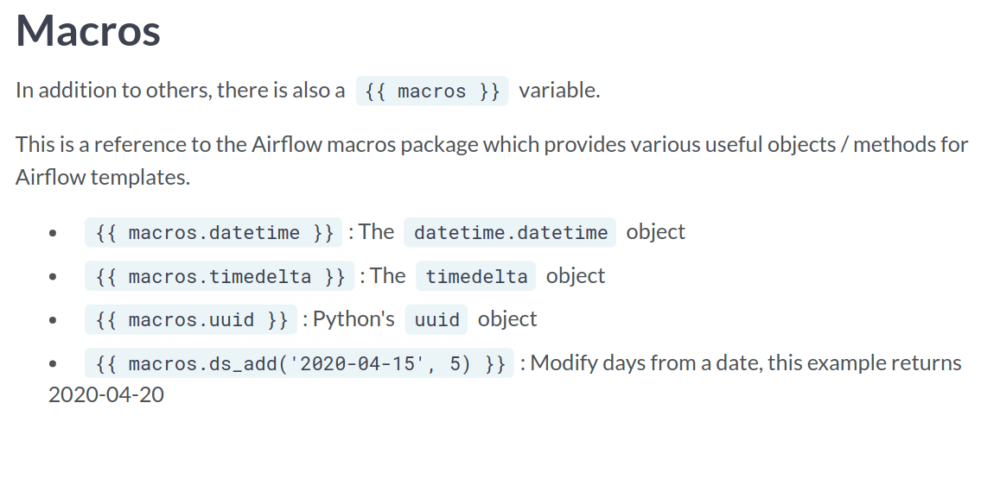
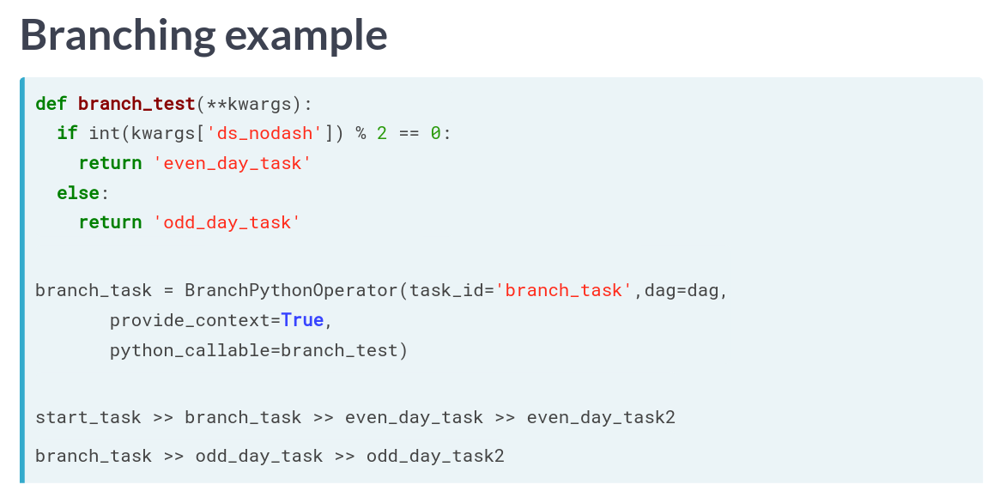

# Introduction to Airflow in Python
## Mike Metzger

# Intro to Airflow
- **Data Engineering** is taking any action involving data and turning it into a reliable, repeatable and maintainanble process.
- A **Workflow** is a set of steps to accomplish a given data engineering task.
- Apache Airflow is a platform to program workflows in general.
- They are implemented as **Directed Acyclical Graphs**.
There are other tools as well:
  * Luigi
  * SSIS
  * Bash Scripting.
- An example of a simple dag is:
```python
etl_dag = DAG(
  dag_id = 'etl_pipeline',
  default_args = {'start_date': "2020-01-08"}
)
```
- There are multiple ways to run dags but the easiest is via the command line:
```bash
airflow run <dag_id> <task_id> <start_date>
# airflow run example-etl download-file 2020-01-10
```
- DAGs have the attributes:
  1. It is directed; meaning there is an inherent flow.
  2. It does not loop or repeat.
  3. Graph is the representation of the compenents.

- You can get the list of subcommands at the command line using `airflow -h`.
- You can see all recognized dags using `airflow list_dags`.
- Example Dag:
```python
# Import the DAG object
from airflow.models import DAG

# Define the default_args dictionary
default_args = {
  'owner': 'dsmith',
  'start_date': datetime(2020, 1, 14),
  'retries': 2
}

# Instantiate the DAG object
etl_dag = DAG(dag_id='example_etl', default_args=default_args)
```
- You'll spend most of your time on the **Dags Page**.
- The **Dag Detial View** gives us specific details about the dag task.


# Implementing Airflow DAGs
- **Airflow Operators** represent a single task in a workflow.
- The `BashOperator` requires three arguments:
  1. `task_id`; the name in the UI
  2. `bash_command`; the raw command or script
  3. `dag`; the actual DAG it's attached to.
- Try not to use Environmental variables since they're not going to be defined.
- Can be tricky to run tasks with elevated privileges.
```python
# Import the BashOperator
from airflow.operators.bash_operator import BashOperator

# Define the BashOperator
cleanup = BashOperator(
    task_id='cleanup_task',
    # Define the bash_command
    bash_command='cleanup.sh',
    # Add the task to the dag
    dag=analytics_dag
)
```
- Tasks are instantiated operators.
- Task dependencies are not required for a workflow but are usually present.
- Tasks are usually referred to as **Upstream** or **Downstream** depending on its relationship to other tasks.
- Since 1.8, tasks are defined using the bit shift operators:
  * `>>`: Upstream
  * `<<`: Downstream
- Examples:
```python
# Set pull_sales to run prior to cleanup
pull_sales >> cleanup

# Configure consolidate to run after cleanup
consolidate << cleanup

# Set push_data to run last
consolidate >> push_data
```
- the `PythonOperator()` is like the bash version but instead expects python code.
- Print statements end up in the logs.
- You can pass a `opt_kwargs` defined dictionary to pass values to the functions.
```python
def sleep(length_of_time):
  time.sleep( length_of_time)

sleep_task = PythonOperator(
  task_id='sleep',
  python_callable='sleep',
  op_kwargs = {'length_of_time':5},
  dag=example_dag
)
```
- There are other operators in the ecosystem.
- One such is the `EmailOperator` from the `airflow.operators` sublibrary.

```python
# Import the Operator
from airflow.operators.email_operator import EmailOperator

# Define the task
email_manager_task = EmailOperator(
    task_id='email_manager',
    to ='manager@datacamp.com',
    subject='Latest sales JSON',
    html_content='Attached is the latest sales JSON file as requested.',
    files='parsedfile.json',
    dag=process_sales_dag
)

# Set the order of tasks
pull_file_task >> parse_file_task >> email_manager_task
```
- A **GAG Run** is a specific instance of a workflow at a point in time.
- It can be run manually or scheduled via the parameter `schedule_interval`
- You can see all the dag runs under the Browse Page:

- There are some attributes that we should be aware of while building runs:
  * `start_date`: when the Dag is allowed to start running.
  * `end_date`: An optional argument which can define when it should stop being scheduled.
  * `max_tries`: Optional attribute for how many attempts to make.
  * `schedule_interval`: defines how often the dag shoudl run.
- The actual schedule can be defined using the cron sytle syntax or prebuilt presets.
- Some presets are:


- Remember that the `state_date` is exclusive and not inclusive.
```python
# Update the scheduling arguments as defined
default_args = {
  'owner': 'Engineering',
  'start_date': datetime(2019, 11, 1),
  'email': ['airflowresults@datacamp.com'],
  'email_on_failure': False,
  'email_on_retry': False,
  'retries': 3,
  'retry_delay': timedelta(minutes=20)
}

dag = DAG('update_dataflows', default_args=default_args, schedule_interval='30 12 * * 3')
```


# Maintaining and monitoring Airflow workflows
- A **Sensor** is an operator that waits for a condition to be true.
- Examples could be:
  * Creation of a file.
  * Upload of a database record.
  * Certain response from a web request.
- Since they're operators, they're assigned to tasks the same.
- All *sensors* are derevied from `airflow.sensors.base_sensor_operator`.

- The *File Sensor* checks for the existence of a file.
- It can be found in `airflow.contrib.sensors.`.
```python
from airflow.contrib.sensors.file_sensor import file_sensor

file_sensor_task = FileSensor(
  task_id='file_sense',
  filepath = 'salesdata.csv',
  poke_interval=300,
  dag=sales_report_dag
)
```
- There are plenty of other sensors as well:

- You should use a sensor when:
  * Uncertain when it will be true.
  * If failure not immediately desired.
  * To add task repetition without loops.
- In Airflow, an **Executor** is what actually runs the task.
- Different Executors handle running tasks differently.
- Here are a few examples:
  * SequentialExecutor
  * LocalExecutor
  * CeleryExecutor
- The default is `SequentialExecutor` which only runs one task at a time.
- It is useful for debugging since it is simple to follow the flow of tasks.
- The `LocalExecutor` treats each task as a process on the system.
- It does only run on a single system though.
- The last we'll look at is `CeleryExecutor` which uses **Celery** as a backend task manager.
- This is significantly more difficult to setup and configure.
- You can check which is being used via the airflow.cfg file.
- It should also be listed in the `airflow list_dags` command.
- The most common reason a Dag is not run on schedule is that the Scheduler is not running.
- Don't forget that there is only one task slot by default since `SequentialExecutor` is the default executor.
- Sometimes the dag just wont show up in the list of dags so make sure it's in the correct folder.
- The sometimes there is just a syntax error in the actual dag file you're trying to run.
- An **SLA** stands for a **Service Level Agreement**.
- In Airflow, this is the amount of time a task is thought should take to run.
- An email gets sent out but also can be seen in the UI.
- This is passed along with the task:
```python
task1 = BashOperator(task_id='sla_task',
  bash_command = 'runcode.sh',
  sla=timedelta(seconds=30),
  dag=dag)
```
- You can also add it to the default args dictionary which is then applied to all tasks in the dag.
- Airflow also comes with some general reporting options.
- These are passed with the default_args dict:

- Here is an example:
```python
# Define the email task
email_report = EmailOperator(
        task_id='email_report',
        to='airflow@datacamp.com',
        subject='Airflow Monthly Report',
        html_content="""Attached is your monthly workflow report - please refer to it for more detail""",
        files=['monthly_report.pdf'],
        dag=report_dag
)

# Set the email task to run after the report is generated
email_report << generate_report
```


# Building production pipelines in Airflow
- **Airflow Templates** allow substituting information when a DAG runs.
- They provide added flexibility with tasks.
- These are done using `Jinja`.
- First, we create a variable with out template:
```python
templated_command = """
echo "Reading {{ params.filename }}"
"""

t1 = BashOperator(task_id = 'template_task',
  bash_command=templated_command,
  params={'filename': 'file1.txt'},
  dag=example_dag)
```
- Example:
```python
default_args = {
  'start_date': datetime(2020, 4, 15),
}

cleandata_dag = DAG('cleandata',
                    default_args=default_args,
                    schedule_interval='@daily')

# Create a templated command to execute
# 'bash cleandata.sh datestring'
templated_command = """
  bash cleandata.sh {{ ds_nodash }} {{ params.filename }}
"""

# Modify clean_task to use the templated command
clean_task = BashOperator(task_id='cleandata_task',
                          bash_command=templated_command,
                          params={'filename': 'salesdata.txt'},
                          dag=cleandata_dag)

# Create a new BashOperator clean_task2
clean_task2 = BashOperator(task_id='cleandata_task2',
                           bash_command=templated_command,
                           params={'filename': 'supportdata.txt'},
                           dag=cleandata_dag)

# Set the operator dependencies
clean_task >> clean_task2
```
- While this is possible, Jinja lets us iterate over them:
```python
templated_command="""

echo "Reading {{ filename }}"

"""

t1 = BashOperator(task_id='template_task',
  bash_command=templated_command,
  params={'filenames': ['file1.txt', 'file2.txt']},
  dag=example_dag)
```
- Airflow comes with some built-in runtime variables which provide information on DAG runs, tasks, system configs.
- Some examples are:
  * `{{ ds }}` for execution date.
  * `{{ ds_nodash}}` for execution date without dashes.
  * `{{ prev_ds }}` for previous execution date.
  * `{{ prev_ds_nodash }}` for previous execution date with no dashes.
  * `{{ dag }}` for the full dag object.
  * `{{ conf }}` for the airflow configs.
- In addition, there is a `{{ macro }}` variable with lots of other useful objects and methods.

- Example HTML template:
```python

html_email_str = """
Date: {{ ds }}
Username: {params.username}
"""

email_dag = DAG('template_email_test',
                default_args={'start_date': datetime(2020, 4, 15)},
                schedule_interval='@weekly')

email_task = EmailOperator(task_id='email_task',
                           to='testuser@datacamp.com',
                           subject="{{ macros.uuid.uuid4() }}",
                           html_content=html_email_str,
                           params={'username': 'testemailuser'},
                           dag=email_dag)
```
- Branching allows for conditional logic in Airflow.
- You can import it using `from airflow.operators.python_operator import BranchPythonOperator`.
- It will take a `python_callable` to return the next task or list of ids.

```python
# Create a function to determine if years are different
def year_check(**kwargs):
    current_year = int(kwargs['ds_nodash'][0:4])
    previous_year = int(kwargs['prev_ds_nodash'][0:4])
    if current_year == previous_year:
        return 'current_year_task'
    else:
        return 'new_year_task'

# Define the BranchPythonOperator
branch_task = BranchPythonOperator(task_id='branch_task', dag=branch_dag,
                                   python_callable=year_check, provides_context=True)
# Define the dependencies
branch_dag >> current_year_task
branch_dag >> new_year_task
```
- The help for an operator will tell you if it supports templates_fields.


# Review:

# Reference:
