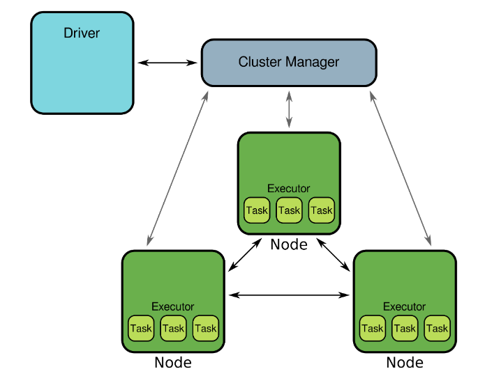
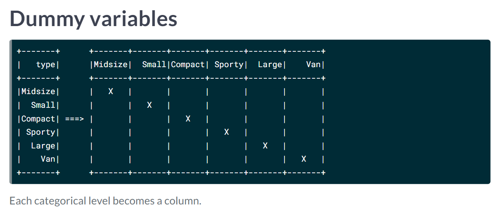
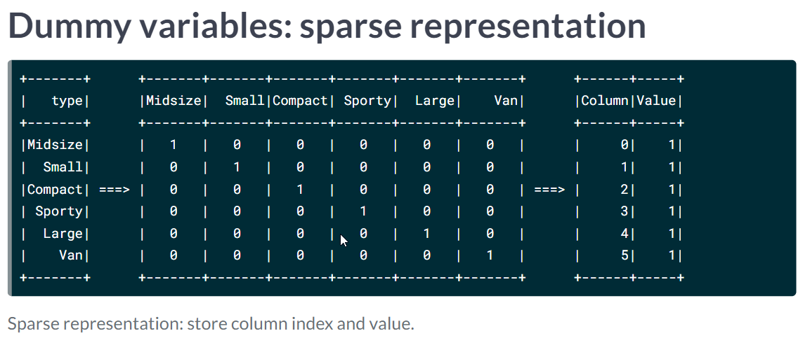
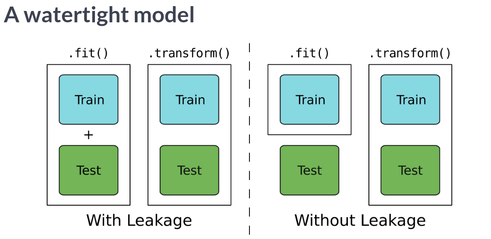

# Machine Learning With Apache Spark
## Andrew Collier

# Introduction
- There are two ways ways to approach giving computers:
  1. Give them explicit instructions to follow.
  2. Give them lots of examples and have it write the rules.
- Most Machine Learning problems into Regression and Classification.
- The performance of these models is dependent on Data.
- In general, more data is usually better.
- However, as we get more data we end up having to wait longer due to IO and calculations.
- One solution for this is distributed across a cluster.
- Spark is a general purpose framework for cluster computing.
- Anatomy of a Spark Cluster:
  * One of more **Nodes**.
  * **Node**: is a computer with RAM, CPU and storage.
  * A **Cluster Manager** allocates resources and coordinates activity across the cluster.
  * A **Driver** communicates with the *Cluster Manager* who then allocates out the work.
  * On each *Node*, Spark launches **Executors** which manages tasks.

- There are 4 languages for interacting with spark right now:
  1. Java.
  2. Scala.
  3. Python.
  4. R
- Python doesn't natively talk with Spark so we will need to use the package *pyspark*.
- You import it using: `import pyspark`.
- Since the version is constantly changing, you will want to know which version you're using.
- You can check this with `pyspark.__version__`.
- We're going to be using version *2.4.1* for the class.
- There are a few sub modules that assist with different interfaces:
  * `pyspark.sql` for SQL Databases.
  * `pyspark.streaming` for handling streaming Data.
  * `pyspark.ml` for Machine Learning
- The next thing you'll want to do is tell Spark where the Spark cluster is.
- You pass it a spark url to the master node: `spark://<ip-or-DNS-name>:<port>`
- The Clustered environment can get in the way sometimes and you can use a local instead.
- When you do that, you can specify the number of cores to use by passing it like:
``` python
local     # one core.
local[4]  # 4 cores
local[*]  # all cores
```
- You connect to Spark using a **Spark Session**.
```python
from pyspark.sql import SparkSession

spark = SparkSession.builder \           # delete these comments or it will fail
        .master('local[*]') \            # specify number of cores.
        .appName('spark-a-doodle-doo') \ # name the application,task
        .getOrCreate()                   # get a session object or create a new one.

        # What version of Spark?
        print(spark.version)
```
- It is good practice to stop the spark session when you're done: `spark.stop()`.
- Spark interacts with data in the tabular from called DataFrame.
- All columns have names and a specific data type.
- Functions:
  * `.count()` is the number of rows.
  * `.show()` shows a subset of rows.
  * `.printSchema()` shows the types of data of rows, columns.
- The *spark* session object we created has a read.csv function; set as True.
```python
cars = spark.read.csv('<filename>.csv', header=True)
```
- There are other options you can pass:
  * `sep` is the delimiter character; comma by default here.
  * `schema` is the column data types declared.
  * `inferSchema` is whether to guess the data types.
  * `nullValue` is placeholder for missing data.
- The .csv function treats all columns as strings by default.
- If you ask it to infer the data types, then it will be forced to look over all the data a second time.
```python
# Read data from CSV file
flights = spark.read.csv('flights.csv',
                         sep=',',
                         header=True,
                         inferSchema=True,
                         nullValue='NA')

# Get number of records
print("The data contain %d records." % flights.count())

# View the first five records
flights.show(5)

# Check column data types
flights.dtypes
```
- Here is how you define and pass types:
```python
from pyspark.sql.types import StructType, StructField, IntegerType, StringType

# Specify column names and types
schema = StructType([
    StructField("id", IntegerType()),
    StructField("text", StringType()),
    StructField("label", IntegerType())
])

# Load data from a delimited file
sms = spark.read.csv('sms.csv', sep=';', header=False, schema=schema)
```


# Classification
- There are two ways to manage columns you care about: drop unnecessary or select necessary.
```python
data = df.drop('column1', 'column2')

data2 = df.select( 'column1', ...)
```
- You can use the function `.filter()` with a logical predicate to select rows:
```python
data.filter('col IS NULL').count()
```
- Or, you can drop any record with missing values using `df.dropna()`; take care when doing this.
- You can create new columnns using the function `.withColumn()`.
```python
from pyspack.sql.functions import round

data = data.withColumn('new-name', <func> )
```
- To one hot encode a column from string to number using the function `StringIndexer`.
```python
from pyspark.ml.feature import StringIndexer

indexer = StringIndexer(inputCol = '<name1>', outputCol = '<name2>')

# Assign index values to strings
indexer = indexer.fit( cars )

# create column with index values
cars = indexer.transform(cars)
```
- If you want to setup the order independent of frequency, then use the function `stringOrderType`.
- You will need to force the data into a single vector for Spark to compute with.
```python
from pyspark.ml.feature import VectorAssembler

assembler = VectorAssembler( inputCols = ['col1', 'col2'], outputCol = 'features')
assembler.transform(cars)
```
- Example:
```python
# Repeat the process for the other categorical feature
flights_indexed = StringIndexer(inputCol='org', outputCol='org_idx').fit(flights_indexed).transform(flights_indexed)
```
- Our first model is going to be a **Decision Tree** since it's the most intuitive.
- It is created using **Recursive Partitioning**.
- Before training, we'll want to randomly split our data using the function `.randomSplit([.8,.2], seed=<n>)`
```python
data_train, data_test = cars.randomSplit([.8,.2], seed=<n>)
```
- Now we're going to start making the model.
- We're going to need `DecisionTreeClassifier`.
```python
from pyspark.ml.classification import DecisionTreeClassifier

tree = DecisionTreeClassifier()
tree tree.fit(cars_train)
```
- Now you'll be able to make predictions from the test set.
```python
predictions = tree.transform( cars_test)
```
- A good way to confirm the model success is a **Confusion Matrix**.
- You can calculate that with: `prediction.groupBy('label', 'prediction').count().show()`.
```python
# Create a confusion matrix
prediction.groupBy('label', 'prediction').count().show()

# Calculate the elements of the confusion matrix
TN = prediction.filter('prediction = 0 AND label = prediction').count()
TP = prediction.filter('prediction = 1 AND label = prediction').count()
FN = prediction.filter('prediction = 0 AND label != prediction').count()
FP = prediction.filter('prediction = 1 AND label != prediction').count()

# Accuracy measures the proportion of correct predictions
accuracy = (TP + TN) / ( TP + TN + FP + FN )
print(accuracy)
```
- Logistic Regression is another commonly used Classification Model.
- Since the logistic regression has values between 0 and 1, it is sometimes thought of as a probability.
- Setting up the Logistic Regresion from spark is very similar to the Tree:
```python
from pyspark.ml.classification import LogisticRegression
logistic = LogisticRegression()
logistic = logistic.fit( data_train)
```
- **Precision** is the number of positive predictions which are correct.
- **Recall** is the number of positive targets predicted.
- Another way to score the model is weighting them based on positive and negative predictions.
- You can do this by creating and calling an *Evaluator Metric*.
```python
from pyspark.ml.evaluation import MulticlassClassificationEvaluator
evaluator = MulticlassClassificationEvaluator()
evaluator.evaluate(prediction, {evaluator.metricName: 'weightedPrecision'})
```
- By default, the threshold is set to half but it's not the only choice.
- The **ROC Curve** plots the True Positive rate vs the False Positive rate.
```python
from pyspark.ml.evaluation import MulticlassClassificationEvaluator, BinaryClassificationEvaluator

# Calculate precision and recall
precision = TP / (TP + FP)
recall = TP / (TP + FN)
print('precision = {:.2f}\nrecall    = {:.2f}'.format(precision, recall))

# Find weighted precision
multi_evaluator = MulticlassClassificationEvaluator()
weighted_precision = multi_evaluator.evaluate(prediction, {multi_evaluator.metricName: "weightedPrecision"})

# Find AUC
binary_evaluator = BinaryClassificationEvaluator()
auc = binary_evaluator.evaluate(prediction, {binary_evaluator.metricName: "areaUnderROC"})
```
- It's said that 80% of Machine Learning is data preparation.
- Now we're going to look at making a Term Document Matrix.
- First we'll need to tokenize the input strings with `Tokenizer`.
```python
from pyspark.ml.feature import Tokenizer
books = Tokenizer(inpoutCol='<col1>', outputCol='<col2>').transfrom(books)
```
- Some words are cofrequent and are **Stop Words** that contain very little information.
- We'll remove them using an instance of the class `StopWordsRemover`.
```python
from pyspark.ml.fetaure import StopWordsRemover
stopwords = StopWordsRemover()

# look at stop words
stopwords.getStopWords()
```
- Since you didn't give the column name before, you'll need to do that now:
```python
stopwords = stopwords.setInputCol('tokens').setOutputCol('words')
books = stopwords.transform(books)
```
- However, since most documents don't contain most values it's most columns will be empty.
- We deal with this **Sparse Matrix** using **Feature Hashing**
```python
from pyspark.ml.feature import HashingTF
hasher = HashingTF(inputCol='words', outputCol='hash', numFeatures=32)
books = hasher.transform(books)
```
- Finally, if a word is very common then it's going to be less useful for being a classifier.
- We want to weight how frequently a word shows up in a document vs all documents.
```python
from pyspark.ml.feature import IDF
books = IDF(inputCol='hash', outputCol='features').fit(books).transform(books)
```
- Here is some code to do tokenizing:
```python
# Import the necessary functions
from pyspark.sql.functions import regexp_replace
from pyspark.ml.feature import Tokenizer

# Remove punctuation (REGEX provided) and numbers
wrangled = sms.withColumn('text', regexp_replace(sms.text, '[_():;,.!?\\-]', ' '))
wrangled = wrangled.withColumn('text', regexp_replace(wrangled.text, '[0-9]', ' '))

# Merge multiple spaces
wrangled = wrangled.withColumn('text', regexp_replace(wrangled.text, ' +', ' '))

# Split the text into words
wrangled = Tokenizer(inputCol='text', outputCol='words').transform(wrangled)

wrangled.show(4, truncate=False)
```
- Example of tokenization:
```python
from pyspark.ml.feature import StopWordsRemover, HashingTF, IDF

# Remove stop words.
wrangled = StopWordsRemover(inputCol='words', outputCol='terms')\
      .transform(sms)

# Apply the hashing trick
wrangled = HashingTF(inputCol='terms', outputCol='hash', numFeatures=1024)\
      .transform(wrangled)

# Convert hashed symbols to TF-IDF
tf_idf = IDF(inputCol='hash', outputCol='features')\
      .fit(wrangled).transform(wrangled)

tf_idf.select('terms', 'features').show(4, truncate=False)
```


# Regression
- We'll usually one-hot encode categorical values but the numbers don't have objective meaning.
- Instead, we will create a dummy value that shows which column is flagged:

- This can get quite expensive though and we'll replace this with this:

- Now for how to do this in spark:
```python
from pyspark.ml.feature import OneHotEncoderEstimator
onehot = OneHotEncoderEstimator(inputCols=['type_idx'], outputCols=['type_dummy'])
onehot = onehot.fit(cars)
```
- A **Dense Vector** is where each element is stored explicitly.
```python
# Import the one hot encoder class
from pyspark.ml.feature import OneHotEncoderEstimator

# Create an instance of the one hot encoder
onehot = OneHotEncoderEstimator(inputCols=['org_idx'], outputCols=['org_dummy'])

# Apply the one hot encoder to the flights data
onehot = onehot.fit(flights)
flights_onehot = onehot.transform(flights)

# Check the results
flights_onehot.select('org', 'org_idx', 'org_dummy').distinct().sort('org_idx').show()
```
- This is essential for building regression models.
- Review of Linear Regression for the 10000000000x time.
- The model is creatd using the Linear Regresssion Class.
```python
from pyspark.ml.regression import LinearRegression
regression = LinearRegression(labelCol='consumption')
regression = regression.fit(cars_train)
predictions = regression.transform(cars_test)

from pyspark.ml.evaluation import RegressionEvaluator
RegressionEvaluator(labelCol='consumption').evalutate(predictions)

# feature coefficients
regression.coefficients
# feature intercept:
regression.intercept
```
- Example:
```python
from pyspark.ml.regression import LinearRegression
from pyspark.ml.evaluation import RegressionEvaluator

# Create a regression object and train on training data
regression = LinearRegression(labelCol='duration').fit(flights_train)

# Create predictions for the testing data and take a look at the predictions
predictions = regression.transform(flights_test)
predictions.select('duration', 'prediction').show(5, False)

# Calculate the RMSE
RegressionEvaluator(labelCol='duration').evaluate(predictions)
```
- It is often convenient to bucket continuous values such as age to make calculations faster.
- You can do this with:
```python
from pyspark.ml.feature import Bucketizer
bucketizer = Bucketizer(splits=[3500, 4500,6000,6500], inputCol = 'rpm', outputCol='rbm_bin')
cars = bucketizer.transform(cars)
```
- There are other kinds of feature engineering as well:
  * `log()`
  * `sqrt()`
  * `pow()`
- Example:
```python
# Find the RMSE on testing data
from pyspark.ml.evaluation import RegressionEvaluator
RegressionEvaluator(labelCol='duration').evaluate(predictions)

# Average minutes on ground at OGG for flights departing between 21:00 and 24:00
avg_eve_ogg = regression.intercept
print(avg_eve_ogg)

# Average minutes on ground at OGG for flights departing between 00:00 and 03:00
avg_night_ogg = regression.intercept + regression.coefficients[8]
print(avg_night_ogg)

# Average minutes on ground at JFK for flights departing between 00:00 and 03:00
avg_night_jfk = regression.intercept + regression.coefficients[8] + regression.coefficients[3]
print(avg_night_jfk)
```
- Now we're going to learn about how to build a model which only selects the most important features.
- This is called **Regularization**.
- The idea is that the model is punished for having too many coefficients.
- There are two standard regularization terms:
  1. **Lasso**: absolute value of the coefficients.
  2. **Ridge**: square of the coefficients.
- It is also possible to have a mix of them.
- The strength of the regularization is managed by a variable denoted as Llambda.
- When L is 0, there is no regularization.
- When L is INF, all coefficients are 0.
- To control this, you'd pass the parameter `elasticNetParam=0` for Ridge and `elasticNetParam=1` for lasso.
- Example:
```python
from pyspark.ml.regression import LinearRegression
from pyspark.ml.evaluation import RegressionEvaluator

# Fit Lasso model (α = 1) to training data
regression = LinearRegression(labelCol='duration', regParam=1, elasticNetParam=1).fit(flights_train)

# Calculate the RMSE on testing data
rmse = RegressionEvaluator(labelCol='duration').evaluate(regression.transform(flights_test))
print("The test RMSE is", rmse)

# Look at the model coefficients
coeffs = regression.coefficients
print(coeffs)

# Number of zero coefficients
zero_coeff = sum([beta == 0 for beta in regression.coefficients])
print("Number of ceofficients equal to 0:", zero_coeff)
```


# Ensembles and Pipelines
- Now we're going to learn how to improve the models with pipelines.
- Make sure to only apply the fit method to training data.
- **Leakage** occurs whenever a fit model is applied to testing data.

- A pipeline is a method to combine a series of steps or operations together.

- We will be importing and using the pipeline class:
```python
from pyspark.ml import Pipeline

pipeline = Pipeline(stages=[indexer, onehot, assemble, regression])
pipeline = pipeline.fit( cars_train )
predictions = pipeline.transform( cars_test )
```
- You can access the stages in the pipeline using the `.stages` attribute of the pipeline.
- Example:
```python
# Import class for creating a pipeline
from pyspark.ml import Pipeline
# Convert categorical strings to index values
indexer = StringIndexer(inputCol='org', outputCol='org_idx')

# One-hot encode index values
onehot = OneHotEncoderEstimator(
    inputCols=['org_idx', 'dow'],
    outputCols=['org_dummy', 'dow_dummy']
)

# Assemble predictors into a single column
assembler = VectorAssembler(inputCols=['km', 'org_dummy', 'dow_dummy'], outputCol='features')

# A linear regression object
regression = LinearRegression(labelCol='duration')

# Construct a pipeline
pipeline = Pipeline(stages=[indexer, onehot, assembler, regression])

# Train the pipeline on the training data
pipeline = pipeline.fit( flights_train )

# Make predictions on the testing data
predictions = pipeline.transform(flights_test)
```
- or
```python
from pyspark.ml.feature import Tokenizer, StopWordsRemover, HashingTF, IDF

# Break text into tokens at non-word characters
tokenizer = Tokenizer(inputCol='text', outputCol='words')

# Remove stop words
remover = StopWordsRemover(inputCol=tokenizer.getOutputCol(), outputCol='terms')

# Apply the hashing trick and transform to TF-IDF
hasher = HashingTF(inputCol=remover.getOutputCol(), outputCol="hash")
idf = IDF(inputCol=hasher.getOutputCol(), outputCol="features")

# Create a logistic regression object and add everything to a pipeline
logistic = LogisticRegression()
pipeline = Pipeline(stages=[tokenizer, remover, hasher, idf, logistic])
```
- We've been using a pretty rudimentary testing on the data.
- The problem with this is you only get one estimate on the model performance.
- You would get a better idea if we could test it multiple times.
- Bring it **Cross Validation**.

- One split, you can start cross validating.
- To do this, you will first need a model and an evaluator.
- Now we're going to be using two new classes:
```python
from pyspark.ml.tuning import CrossValidator, ParamGridBuilder
params = ParamGridBuilder().build()

cv = CrossValidator(estimator=regression,
                    estiamtorParamMaps=params,
                    evaluator=evaluator,
                    numFolds=10, seed=13)
cv = cv.fit(cars_train)
cv.avgMetrics
```
- or
```
# Create an indexer for the org field
indexer = StringIndexer(inputCol='org', outputCol='org_idx')

# Create an one-hot encoder for the indexed org field
onehot = OneHotEncoderEstimator(inputCols=['org_idx'], outputCols=['org_dummy'])

# Assemble the km and one-hot encoded fields
assembler = VectorAssembler(inputCols=['km', 'org_dummy'], outputCol='features')

# Create a pipeline and cross-validator.
pipeline = Pipeline(stages=[indexer, onehot, assembler, regression])
cv = CrossValidator(estimator=pipeline,
          estimatorParamMaps=params,
          evaluator=evaluator)
```
- The model works but we could probably improve it by selecting better model parameters.
- The optimal set of parameters will depend on the data.
- We'll use the `ParamGridBuilder` from before but we'll add to it.
```python
params.addGrid(regression.fitIntercept, [True, False])
# build the grid
params = params.build()
```
- You get the best values from it using the `cv.bestModel`
- Example:
```python
# Create parameter grid
params = ParamGridBuilder()

# Add grids for two parameters
params = params.addGrid(regression.regParam, [0.01, 0.1, 1.0, 10.0]) \
               .addGrid(regression.elasticNetParam, [0.0, 0.5, 1.0])

# Build the parameter grid
params = params.build()
print('Number of models to be tested: ', len(params))

# Create cross-validator
cv = CrossValidator(estimator=pipeline, estimatorParamMaps=params, evaluator=evaluator, numFolds=5)
```
- Now we're going to learn about how to combine models together.
- This is called an **Ensemble Model**.
- A **Random Forest** is a collection of Trees - specifically decision trees.
- Here is how we build them in spark:
```python
from pyspark.ml.classification import RandomForestClassifier
forest = RandomForestClassifier(numTrees=5)
forest.fit( cars_train)\

# you can see the trees using:
forest.trees
```
- The second model we're going to look at is **Graident-Boosted Trees**.
- Instead of building trees that work in parallel, we build trees that work in series.
- Steps:
  1. Build a Decision Tree and add to ensemble.
  2. Predict label for each training instance using ensemble.
  3. Compare Predictions with known labels.
  4. Emphasize training instances with incorrect predictions.
  5. Return to step 1.
- You do this with:
```python
from pyspark.ml.classification import GBTClassifier

gbt = GBTClassifier(maxIter=10)
gbt = gbt.fit(cars_train)

#
```
- You can reason about the trees success rate using the AUC values generated.
- Examples:
```python
from pyspark.ml.classification import DecisionTreeClassifier, GBTClassifier
from pyspark.ml.evaluation import BinaryClassificationEvaluator

# Create model objects and train on training data
tree = DecisionTreeClassifier().fit(flights_train)
gbt = GBTClassifier().fit(flights_train)

# Compare AUC on testing data
evaluator = BinaryClassificationEvaluator()
evaluator.evaluate(tree.transform(flights_test))
evaluator.evaluate(gbt.transform(flights_test))

# Find the number of trees and the relative importance of features
print(gbt.getNumTrees)
print(gbt.featureImportances)
```
```python
# Create a random forest classifier
forest = RandomForestClassifier()

# Create a parameter grid
params = ParamGridBuilder() \
            .addGrid(forest.featureSubsetStrategy, ['all', 'onethird', 'sqrt', 'log2']) \
            .addGrid(forest.maxDepth, [2, 5, 10]) \
            .build()

# Create a binary classification evaluator
evaluator = BinaryClassificationEvaluator()

# Create a cross-validator
cv = CrossValidator(estimator=forest, estimatorParamMaps=params, evaluator=evaluator, numFolds=5)
```
```python
# Average AUC for each parameter combination in grid
avg_auc = cv.avgMetrics

# Average AUC for the best model
best_model_auc = max(cv.avgMetrics)

# What's the optimal parameter value?
opt_max_depth = cv.bestModel.explainParam('maxDepth')
opt_feat_substrat = cv.bestModel.explainParam('featureSubsetStrategy')

# AUC for best model on testing data
best_auc = evaluator.evaluate(cv.transform(flights_test))
```


# Reference:

# Research:
- HashingTF?
