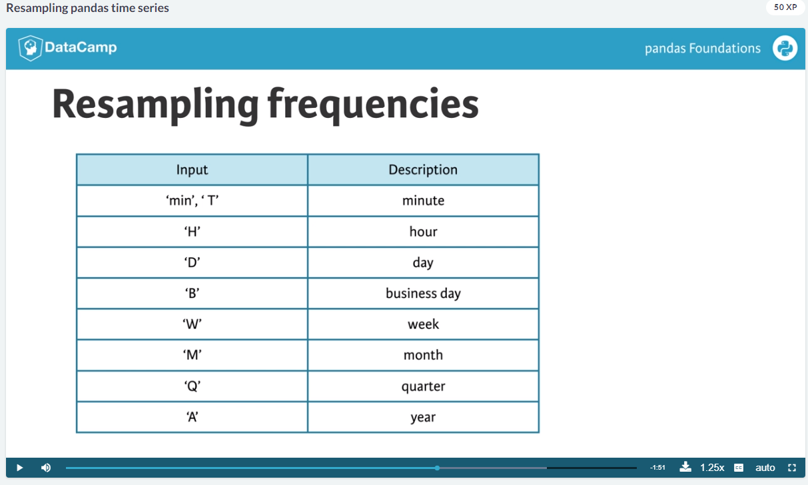

# Pandas Foundations
## Hugo Bowne-Anderson

# Data Ingestion & Inspection
- Pandas is a tool for data Analysis
- The *power tool* of Pandas is the **Data Frame**.
- It is a tabular data structure with labeled rows and columns.
- Rows are ordered using what is called an **Index**.
- There are some accessible values:
  * `.shape` tells you the dimensions of the dataframe.
  * `.columns` tells you the column names.
  * `.index` are the actual row indexes.
- You can slice the values by specifying the rows, columns and stride of the data.
```python
# rows 0:4; all columns
df[:5,:]
```
- You can tell it to only collect every `n` rows using: `.iloc[::<n>,]`.
- You can use the function `.head()` to return just the top rows of the dataframe.
- If you don't pass it a number, it will return 5 rows.
- You can use the function `.tail()` to return the last 5 rows of the dataframe.
- You can use the function `.info()` to return information about all the columns.
- You can broadcast values.
- The columns themselves are their own kind of data structure called a **Series**.
- You can get the values of a *series* using the `.values` accessor.
- You can convert a dictionary into a Dataframe using the function `pd.DataFrame()`.
- It is useful to be able to create data frames from lists since they're so common in python.
- You can create a new column and **Broadcast** the default value to all values:
```python
# this will add a new column called fees and assign the value 0 to them:
users['fees'] = 0
```
- Broadcasting is not limited to only numbers.
- You can rename the columns of a Dataframe by simple assignment.
- You can tell Pandas that there are no headers using the parameter `header=None`.
- You can label the names by passing a list of names to `names = <list.` in the function `pd.read_csv()`.
- You can replace known missing values with `NaN` by passing `na_values = '<term>'`.
- You can also pass a dictionary with the `column:values` pair since different columns can use different values to mean missing.
- You can explicitly tell Pandas which columns are dates using the parameter `parse_dates=[]`.
- You can use the function `.to_csv(<data>)` to write the data to disk.
- You can save to xlsx using the function `.to_xlsx(<data>)`.
- Plotting is done with the *matplotlib* library.
- There is a `.plot()` that is associated with a numpy Series object.
- You will still need to call `plt.show()` to have it shown.
- You can modify the plot style using:
  * `color` for the color.
  * `style` for what kind of line.
  * `legend` for whether to show them or not.
- You can control the graph's axis using the `.axis()` function.
- You can save the file image to disk using the function `.savefig('name.jpg')`.
- It will also infer the type you want from the name you have told it to save as.
```python
# Plot just the Dew Point data
column_list1 = ['Dew Point (deg F)']
df[column_list1].plot()
plt.show()

# Plot the Dew Point and Temperature data, but not the Pressure data
column_list2 = ['Temperature (deg F)','Dew Point (deg F)']
df[ column_list2 ].plot()
plt.show()
```

# Exploratory Data Analysis
- Now we'll discuss *Visual Exploratory Data Analysis*.
- By default, `.plot(x= <col1>, y=<col2>)` plots a line plot.
- You can change the type of plot using the parameter `kind='scatter'`.
- Types:
  * `box` is a boxplot
  * `hist` is a histogram.
- You can specify that you want a **Cumulative Density Function** using the parameter `cumulative=True`.
- You can specify that you want the data normed using the parameter `normed=True`.
```python
# Create a list of y-axis column names: y_columns
y_columns = ['AAPL', 'IBM']

# Generate a line plot
df.plot(x='Month', y=y_columns)

# Add the title
plt.title('Monthly stock prices')

# Add the y-axis label
plt.ylabel('Price ($US)')

# Display the plot
plt.show()
```
```python
# Make a list of the column names to be plotted: cols
cols = ['weight', 'mpg']

# Generate the box plots
df[cols].plot(kind = 'box', subplots = True)

# Display the plot
plt.show()
```
- You can use the function `.describe()` to get summary statistics.
- If you want the actual value then you need to call the function `.count()`.
- This is because Python is lazy loading and wont actually calculate it until you do.
- Asking *pandas* to `.describe()` a row with species information then it will return:
  * The **count** of objects in the column.
  * The number of *unique* values in the column.
  * The most common category.
  * The frequency of the most common.
- To filter in pandas, you will need to select out the indices and then subset them.
```python
indices = iris['species'] == 'setosa'
setosa = iris.loc[indices,:]
```
- You can show multiple plots with:
```python
# Display the box plots on 3 separate rows and 1 column
fig, axes = plt.subplots(nrows=3, ncols=1)
```


# Time Series in Pandas
- Now we'll see how to deal the **Time Series** information.
- The data is stored internally as datetime objects.
- The parameter `parse_dates = True` will help with converting strings of date data into datetime objects.
- When dealing with dates, it is best practice to set the data's index to the date column with `index_col = '<col-name>'`.
- When selecting columns based on data - and the date being the index -, one can use a subset of the date string.
- This feature is called **Partial String Selection**.
- You can use the function `pd.to_datetime()` to convert strings to datetime objects.
- You can *re-index* data using the function `.reindex()`.
- When re-indexing, you can override the default filling of missing values using the parameter `method=<method>`.
- Here are some of the options:
  * `method = 'ffill'` for **Forward Fill**.
  * `method = 'bfill'` for **Back Fill**.
```python
# Prepare a format string: time_format
time_format = '%Y-%m-%d %H:%M'

# Convert date_list into a datetime object: my_datetimes
my_datetimes = pd.to_datetime(date_list, format=time_format)  
```
```python
# Extract the hour from 9pm to 10pm on '2010-10-11': ts1
ts1 = ts0.loc['2010-10-11 21:00:00':'2010-10-11 22:00:00']

# Extract '2010-07-04' from ts0: ts2
ts2 = ts0.loc['2010-07-04']

# Extract data from '2010-12-15' to '2010-12-31': ts3
ts3 = ts0.loc['2010-12-15':'2010-12-31']
```
- You can added times series values together.
- Now we'll discuss sampling from Time Series.
- **Down Sampling** is reducing the datetime rows to slower frequency.
  * I.e. going from daily samples to weekly samples.
- **Up Sampling** is increasing the datetime rows to faster frequency.
  * I.e. going from daily to hourly.
- To specify, you would call `sales.resample('D').<statistic>`.
- Here the `D` stands for *Daily* and not *Down Sample*.
- Columns that are not numerical are ignored.
- Remember to use method chaining when doing the resampling since it's best practice.
- Here are some of the options:

- It allows you to multiply them as well; `.resample('2W')` means over 2 weeks.
- The fill methods are also their own functions: `.ffill()`, `.bfill()`.
```python
# Extract temperature data for August: august
august = df['Temperature']['2010-August']
```
- You can calculate a **Rolling Statistic** using the function `.rolling()`.
```python
# Apply a rolling mean with a 24 hour window: smoothed
smoothed = unsmoothed.rolling(window=24).mean()
```
- You can use some string manipulation methods.
  * `.str.upper()` to convert to all upper case.
  * `.contains()` to look for a particular string.
  * `.dt.tz_localize('US/Central')` to convert times to different timezone.
  * or `.dt.tz_convert('US/Eastern')`.
- You can extract the first value using the function `.first()`.
- Rather than filling, one can also interpolate using the function `.interpolate()`
- There are a few options for this:
  * `linear` for linear regression.
- You can re-set the index using the function `pd.set_index('<column>')`.
- You can also tell it to replace that column using the parameter `inplace=True`.


# Case Study: Sunlight in Austin
- Don't forget to specify the axis when dropping data:
```python
# Remove the appropriate columns: df_dropped
df_dropped = df.drop( list_to_drop, axis = 'columns')
```
```python
# Convert the dry_bulb_faren column to numeric values: df_clean['dry_bulb_faren']
df_clean['dry_bulb_faren'] = pd.to_numeric(df_clean['dry_bulb_faren'], errors='coerce')
```
```python
# Extract the Temperature column from daily_climate using .reset_index(): daily_temp_climate
daily_temp_climate = daily_climate.reset_index()['Temperature']
```
- You don't always need to aggregate:
```python
# Resample is_sky_clear by day
resampled = is_sky_clear.resample('D')
```

# Research:

# Reference:
