# Supply Chain Analytics in Python
## Aaren Stubberfield

# Basics of Supply Chain Optimization and PuLP
- We'll start with the basics of Supply Optimization.
- A **Supply Chain** Consists of all parties involved, directly of indirectly, in fulfilling a customer's request.
- This includes:
  * Suppliers.
  * Internal Manufacturing.
  * Outsourced Logistics Suppliers.
- When fulfilling the request, there are often multiple routes through the supply chain:
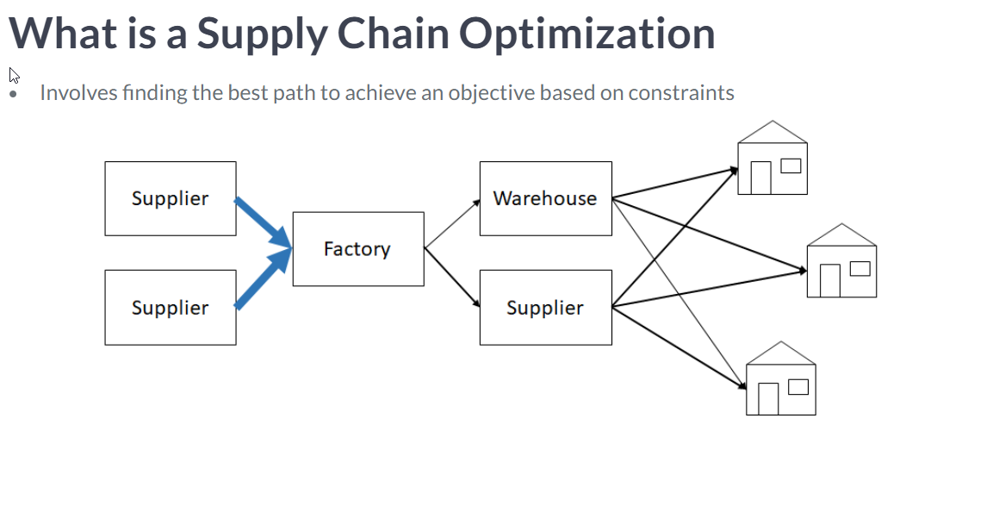
- We're going to get a crash course in **Linear Programming**.
  * It is a Optimization method using a mathematical model whose requirements are linear relationships.
- It's a powerful modeling tool for Optimization.
- The three pieces to these models are:
  1. Decision Variable: what you can control.
  2. Objective Function: Math expression that uses variables to express goals.
  3. Constraints: Math expressions that describe the limits of a solution.
- There are three kinds of these models:
  1. Linear Programming.
  2. Integer Programming.
  3. Mixed Integer Programming.
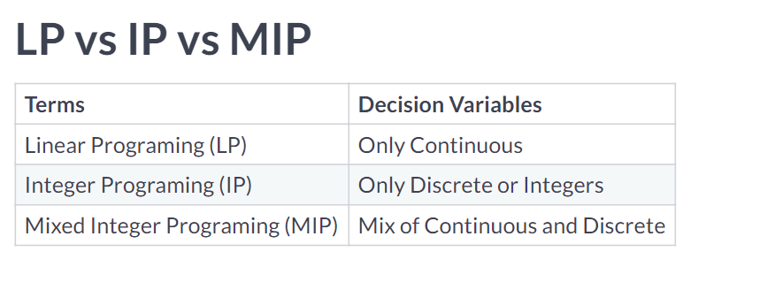
- The course will focus on using the Python **PuLP** library.
- It is a framework for linear and Integer Programming Problems.
- It is maintained by the **Computational Infrastructure for Operations Research(COIN-OR)**.
- There are many different solvers.
- First play problem will focus on **Resource Scheduling**.
  * Profits = 20*A + 40*B
  * Contraints:
    * A, B > 0
    * Cannot exceed 30 days.
    * Worker Packaging them is only available 22 days.
- Steps:
  1. Initialize Model.
  2. Define Decision Variables.
  3. Define the Object Function.
  4. Define the Constraints.
  5. Solve Model.
- To initialize the problem, you'd use the function `LpProblem(name = 'name', sense=LpMinimize)`.
- The parameter `sense` is tells it whether to minimize or maximize ( `LpMaximize`) for the problem.
- Then, we define the Decision Variables using the function `LpVariable`.
- It has 5 arguments:
  * name
  * `lowBound = None`
  * `upBound = None`
  * `cat = 'Continuous'`
  * `e = None`
- Other arguments for `cat` would be `Integer` or `Binary`.
- The `e` parameter is about *column based modeling* which will not get talked about in this course.
- Then, we define our **Objective Function** using the *Variables*.
- Then, we define the constraints.
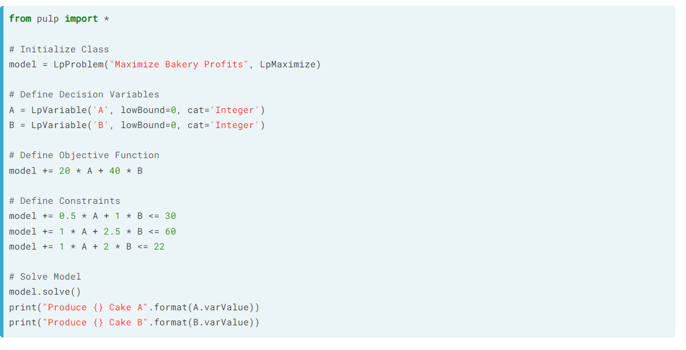
```python
# Initialize Class
model = LpProblem("Maximize Glass Co. Profits", LpMaximize)

# Define Decision Variables
wine = LpVariable('Wine', lowBound=0, upBound=None, cat='Integer')
beer = LpVariable('Beer', lowBound=0, upBound=None, cat='Integer')

# Define Objective Function
model += 5 * wine + 4.5 * beer

# Define Constraints
model += 6 * wine + 5 * beer <= 60
model += 10 * wine + 20 * beer <= 150
model += wine <= 6

# Solve Model
model.solve()
print("Produce {} batches of wine glasses".format(wine.varValue))
print("Produce {} batches of beer glasses".format(beer.varValue))
```
- Moving from Simple Models with 6 products to something like 150 products is a problem with our existing method.
- We're going to do that later, but will assume it was done for now.
- The function `LpSum()` will sum a list of linear expressions.
- Therefore:
```python
model += 20*A + 40*B + ...
```
- ... and:
```python
var_list = [20*A, 40*B, ... ]
lpSum( var_list )
```
- ... are the same.
- It is common to use list or comprehensions for this.
```python
# Define Objective Function
model += lpSum([1.5 * var_dict[(i, 'cream')]
                + .125 * var_dict[(i, 'milk')]
                + .1 * var_dict[(i, 'sugar')]

                # Iterate over product types
                for i in prod_type])
```
- This works?!?:
```python
# Define Objective
model += lpSum([costs[(w, c)] * var_dict[(w, c)]
                for c in customers for w in warehouse])

# For each customer, sum warehouse shipments and set equal to customer demand
for c in customers:
  model += lpSum([var_dict[(w, c)] for w in warehouse]) == demand[c]
```


# Modeling in PuLP
- We have not discussed how to create Variables at scale.
- We can use the function `LpVariable.dicts()` function to help us define them at scale.
- It has the arguments:
  1. `name` for the prefix per LP Variables.
  2. `indexs` for the list of strings of the keys to the dictionary.
  3. Same as before.
```python
# Define decision variables
key = [(m, w, c) for m in months for w in warehouse for c in customers]
var_dict = LpVariable.dicts('num_of_shipments',
                            key,
                            lowBound=0, cat='Integer')

# Use the LpVariable dictionary variable to define objective
model += lpSum([costs[(w, c)] * var_dict[(m, w, c)]
                for m in months for w in warehouse for c in customers])
```
- Example of solving the Traveling Salesmen Problem:
```python
# Define Decision Variables
x = LpVariable.dicts('X', [(c1, c2) for c1 in cities for c2 in cities],
                     cat='Binary')
u = LpVariable.dicts('U', [c1 for c1 in cities],
                     lowBound=0, upBound=(n-1), cat='Integer')

# Define Objective
model += lpSum([dist.iloc[c1, c2] * x[(c1, c2)]
                for c1 in cities for c2 in cities])

# Define Constraints
for c2 in cities:
    model += lpSum([x[(c1, c2)] for c1 in cities]) == 1
for c1 in cities:
    model += lpSum([x[(c1, c2)] for c2 in cities]) == 1
```
- It is not uncommon to realize that you'll need to adjust the model once you've started.
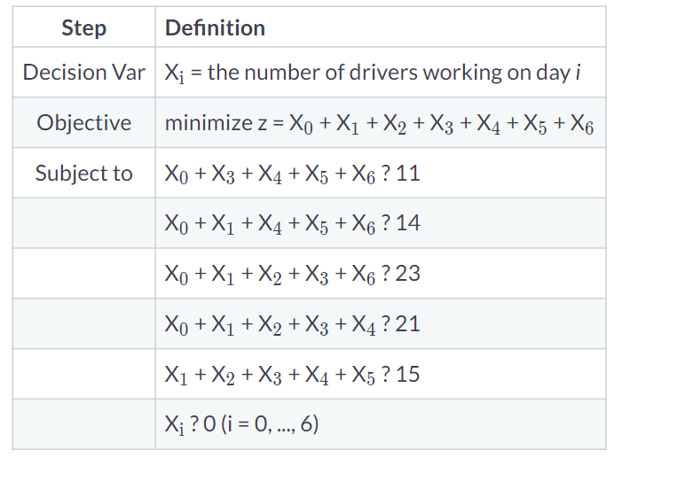
- When we define the dictionary method, we'll need to insert the values:
```python
# The class has been initialize, and x, and days defined
model = LpProblem("Minimize Staffing", LpMinimize)
days = list(range(7))
x = LpVariable.dicts('staff_', days, lowBound=0, cat='Integer')

# Define Objective
model += lpSum([x[i] for i in days])
```
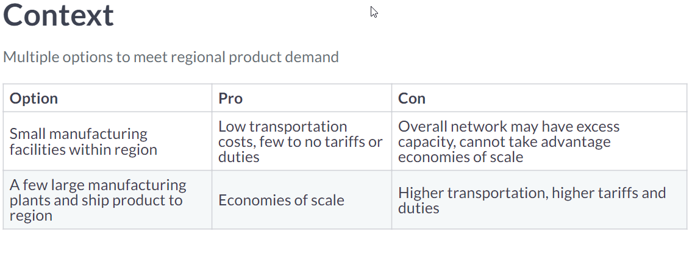
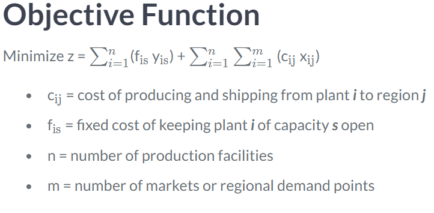
```python
# Initialize, and Define Decision Vars.
model = LpProblem("Capacitated Plant Location Model", LpMinimize)
loc = ['USA', 'Germany', 'Japan', 'Brazil', 'India']
size = ['Low_Cap','High_Cap']
x = LpVariable.dicts("production_", [(i,j) for i in loc for j in loc],
                     lowBound=0, upBound=None, cat='Continous')
y = LpVariable.dicts("plant_",
                     [(i,s) for s in size for i in loc], cat='Binary')

# Define objective function
model += (lpSum([fix_cost.loc[i,s] * y[(i,s)]
                 for s in size for i in loc])
          + lpSum([var_cost.loc[i,j] * x[(i,j)]
                   for i in loc for j in loc]))
```
- Now we're going to talk more about **Logical Constraints**.
- What happens when you need to select when two features are not allowed at the same time?
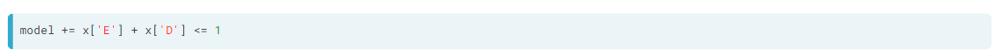
- What happens when there is a dependency where one feature **must** also come along?
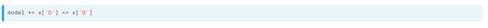
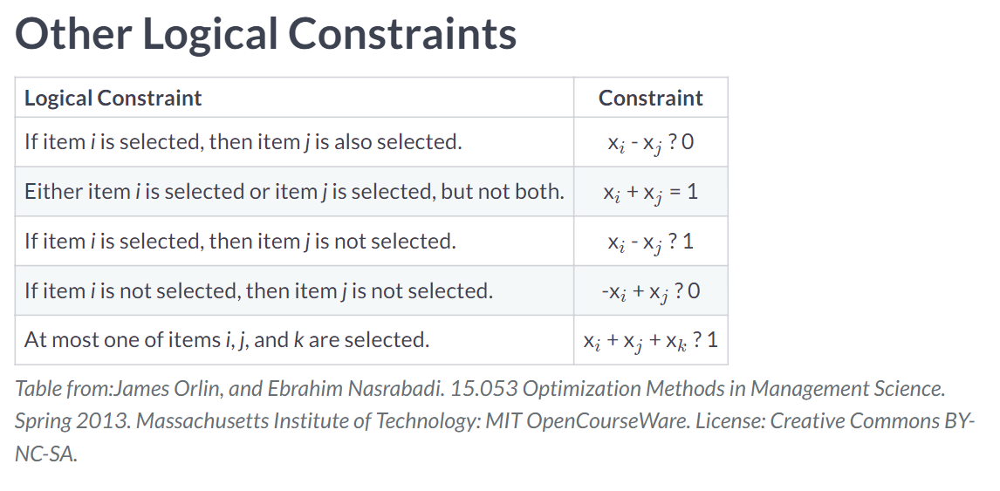
```python
# if first location is selected, then second location is as well.
model += x['A'] - x['D'] <= 0
model += x['B'] - x['E'] <= 0
```


# Solve and Evaluate Model
- **Dependent Demand** is where one product is used as a input to another product.
- The correct constraint formula for 3 of Product A for each Product A is: `3B <= A`
- Common incorrect versions include:
  * `B >= 3A`
  * `B = 3A`
- Once you have a formula for A week, you can set the constraint to 4 instead of 1 to make it for the month.
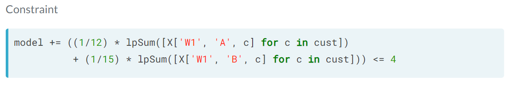
```python
# Initialize, Define Decision Vars., Objective Function, and Constraints
model = LpProblem("Distribution Planning", LpMinimize)
wh = ['W1','W2']
prod = ['A', 'B', 'C']
X = LpVariable.dicts("ship", [(w, p, c) for c in cust for p in prod for w in wh],
                     lowBound=0, cat="Integer")
model += lpSum([X[(w, p, c)]*costs.loc[(w, p), c]  for c in cust for p in prod for w in wh])
for c in cust:
    for p in prod:
        model += lpSum([X[(w, p, c)] for w in wh]) == demand.loc[p, c]

# Define Dependent Demand Constraints
model += ((1/10) * lpSum([X[('W1', 'A', c)] for c in cust])
          + (1/15) * lpSum([X[('W1', 'B', c)] for c in cust])
          + (1/20) * lpSum([X[('W1', 'C', c)] for c in cust])) <= 4
```
- Another example of a constraint:
```python
# Define the constraints
for j in loc:
    model += lpSum([x[(i, j)] for i in loc]) == demand.loc[j,'Dmd']
```
- Now we're going to look at Solving the model.
- This includes:
  1. Call the Solve Method.
  2. Check the Status of the Solution.
  3. Print optimized Decision Variables.
  4. Print optimized Objective Functions.
- The function `.solve()` is what you call to actually attempt to solve the solution.
- Optionally, it takes the name of the solver you want to use as parameter `solver=<None>`.
- Once we have called the solve method, we'll want to check the status of the Solution using `LpStatus[model.status]`.
- There are five possible results:
  1. **Not Solved**.
  2. **Optimal**.
  3. **Infeasible**.
  4. **Unbounded**: probably wrong objective.
  5. **Undefined**: Optimal Solution may exist but may not have been found.
- We often want to konw the values of the optimized solution.
- We can get those using `for v in model.variables(): print( v.name, "=", v.varValue)`
- You can also loop over them and put them in a pandas data frame.
```python
# Print variables
o = [{'prod':x[t].varValue, 'stock':s[t].varValue} for t in time]
print(pd.DataFrame(o, index=time))
```
```python
# Print Objective Fun. Value
print("Total Cost = ", value(model.objective))
```
- When checking a Solution, there are two questions:
  1. Was an Optimal Solution found?
  2. Check the decision variables for being in the expected range.
- If you get a response other than *Optimal* then it should be considered a red flag.
- The package uses a set of heuristics to mitigate the runtime.
- We can also review the model specificatin using the function `writeLP( <filename> )`.


# Sensitivity and Simulation Testing of Model
- When Modeling, we sometimes need to model constraints on input data.
- **Shadow Prices**: The change in optimal value of the objective function per unit increase in the right hand side ofr a constraint, given everything else remain unchanged.
- You can print the *shadow price* of the model by accessing the `.pi` attribute.
- **Slack**: the amount of resource that is unused.
- You can print the *slack* of each unit using the `.slack` attribute.
```python
# Print Shadow Price and Slack
o = [{'name': name, 'shadow price': c.pi, 'slack': c.slack}
     for name, c in model.constraints.items()]
print(pd.DataFrame(o))
```
```
Awesome job! In Step 1, You notice that changing the right-hand-side of a constraint by 1 increases the objective value by the amount of the shadow price. In Step 2, you should have noticed that increasing the right-hand-side of a non-binding constraint will not change the optimal solution. In Step 3, you should have noticed that decreasing the right-hand-side of a non-binding constraint equal to slack will not change the optimal solution but make it a binding constraint. In Step 4, you should have noticed that increasing the right-hand-side by more than the slack with change the optimal solution.
```
- You can actually set the slack to be 0 for a constraint.
```python
# Print the Production Quantities
o = [{'prod':'{} to {}'.format(i,j), 'quantity':x[(i,j)].varValue}
     for i in loc for j in loc]
print(pd.DataFrame(o))

# Print the Plant Values of the different regions
o = [{'lowCap':y[(i,size[0])].varValue, 'highCap':y[(i,size[1])].varValue}
     for i in loc]
print(pd.DataFrame(o, index=loc))

# Print the Objective Value
print('Objective = ', value(model.objective))
```
- Problems that take a long time to solve should not be used with LP or IP.
- In general, we are trying to add random noise to key inputs.
- Keep in mind that *inputs are estimates and there is a risk of them being inaccurate*.
- We start with a basic model without noise.
- Then, we create some noise using the function `normalvariate(0,25)` per input.
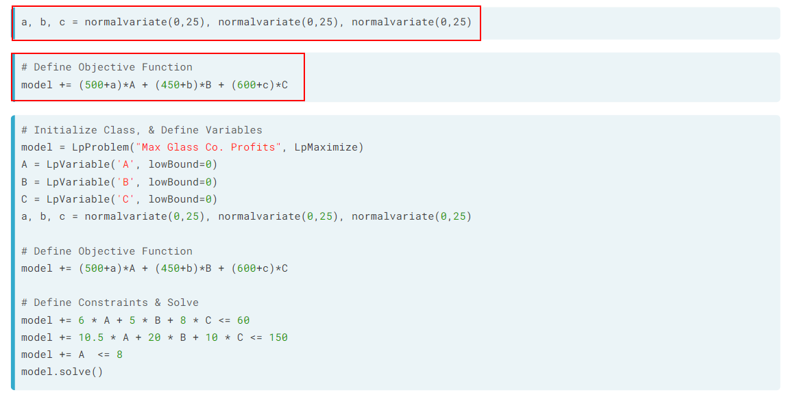
```python
# Print the value count df series Midwest from Atlanta
print(df['Midwest from Atlanta'].value_counts())

# Print the value count df series East from Atlanta
print( df['East from Atlanta'].value_counts())
```
- We can use the Sensitivity Analysis to observe how factors impact the demand and costs of a model.
```python
# Define the Constraints
for j in loc:
    rd = random.normalvariate(0, demand.loc[j,'Dmd'] * 0.05)
    model += lpSum([x[(i, j)] for i in loc]) == (demand.loc[j,'Dmd'] + rd)
```

# Research:
- column based modeling?
- Miller-Tucker-Zemlin (MTZ) showed it can be completed using Integer Linear Programing ( Traveling Salesmen Problem).
- Review the MIT courseware linked in the Other Logical Constraints image.
- "Linear Programming with Python and PuLP" - Ben Keen


# Reference:
 - *Supply Chain Management: Strategy, Planning, and Operations.*

